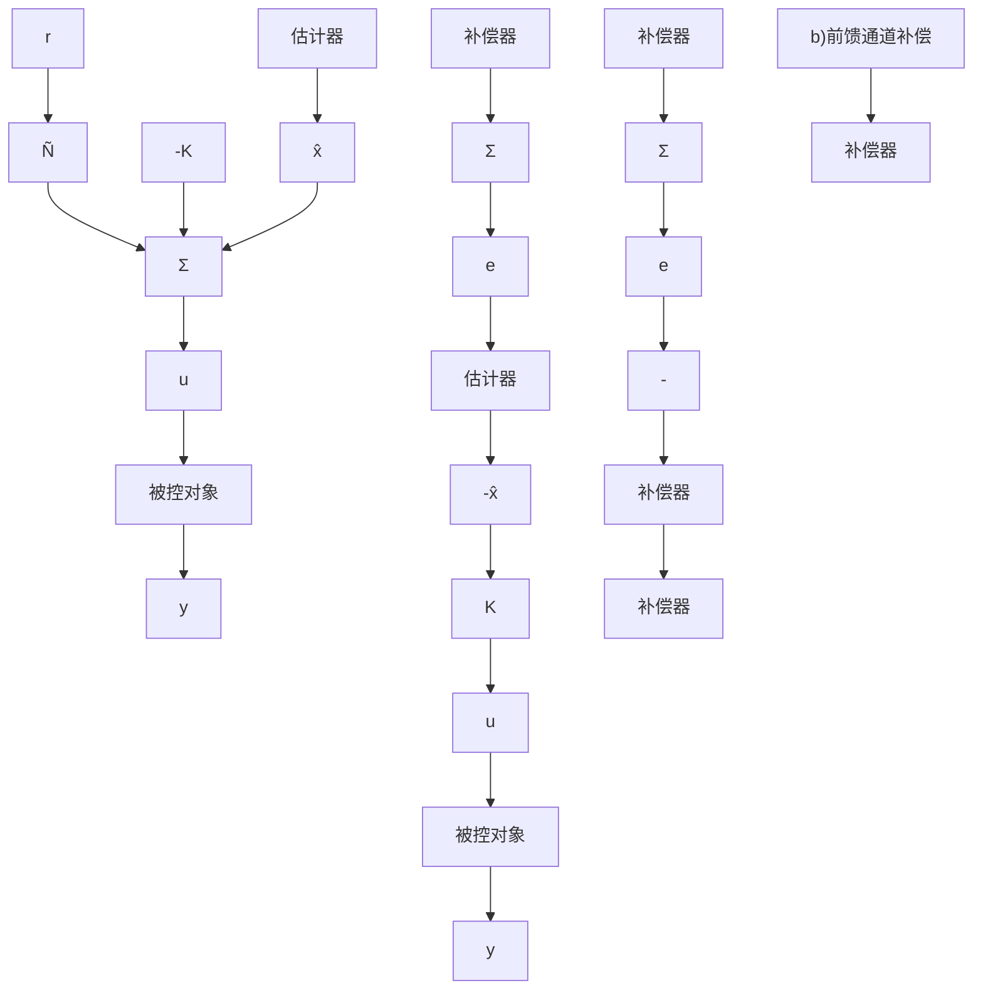

# 7.9 估计器中引入参考输入

将7.5节研究的控制律设计方法与7.8节讨论的估计器设计方法结合起来，本质上是调节器设计。这意味着控制器与估计器的特征方程的选取是为了更好地抑制扰动——对于扰动 $w(t)$ 给出令人满意的暂态性能。然而，这种设计方法没有参考输入也没给出指令跟踪，对指令跟踪可以通过复合系统良好的暂态响应来展示。一般来讲，在设计控制系统过程中，良好的干扰抑制与指令跟踪能力都需要考虑。在系统方程组中引入合适的参考输入，就可以获得到良好的指令跟踪能力。

重写全阶估计器的被控对象与控制器方程组；降阶的情况在概念上是相同的，仅在细节上有所不同。

对于被控对象，

$$\dot {\boldsymbol {x}} = \boldsymbol {A} \boldsymbol {x} + \boldsymbol {B} \boldsymbol {u} \tag {7.183a}y = C x \tag {7.183b}$$

对于控制器，

$$\dot {\hat {x}} = (A - B K - L C) \hat {x} + L y \tag {7.184a}u = - \boldsymbol {K} \hat {\boldsymbol {x}} \tag {7.184b}$$

图 7.47 给出将指令输入 r 引入系统的两种可能性。该图说明了一个普遍存在的问题，即应将补偿放到反馈通道中还是前馈通道中。因为传递函数的零点不同，所以系统对指令输入的响应根据系统结构不同而不同。但是，令 r=0 且注意到两个系统是相同的，就可以很容易证实闭环系统的极点是一致的。

很容易看出两个结构的响应差别。考虑阶跃输入 r 的影响。在图 7.47a 中，阶跃信号激励估计器的方式与激励被控对象的方式完全相同；因此，估计器的误差将在阶跃信号作用过程中与作用后保持为零。这意味着估计器动态不是由指令输入来激励的，所以，从 r 到 y 的传递函数一定有零点处于估计器极点位置上，从而抵消掉那些极点。因此，一个阶跃指令将激励系统行为，使其仅与控制极点一致——即是 $\det(sI-A+BK)=0$ 的根。

图 7.47b 中，阶跃指令 r 直接进入估计器，由此产生估计误差，该误差随估计器的动态特性与相应控制极点的响应而衰减。因此，一个阶跃指令将激励系统行为，使其与控制极点与估计器极点一致，即是

$$\det (s \boldsymbol {I} - \boldsymbol {A} + \boldsymbol {B K}) \cdot \det (s \boldsymbol {I} - \boldsymbol {A} + \boldsymbol {L C}) = 0$$

·的根。

flowchart

图 7.47 引入指令输入的可能位置

基于这个原因，图 7.47a 所示的结构是控制该系统的一种典型优选方式，其中， $\overline{N}$ 可由方程组式(7.97)～式(7.99)得到。

在 7.9.1 小节中，将会介绍引入参考输入的一般结构，该结构有三种选择参数的方式来实现前馈或反馈情况。我们将从系统零点以及零点对系统暂态响应的影响的角度来分析这三种选择方式。最后，7.9.2 小节中我们将会介绍如何选择剩余的参数来消除常值误差。
