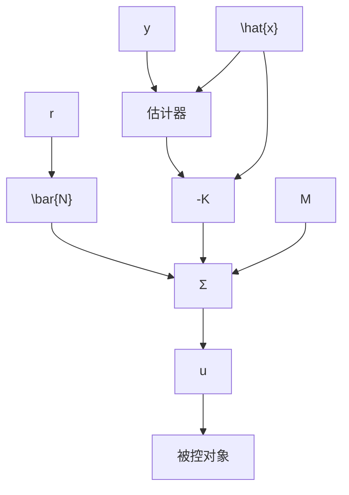
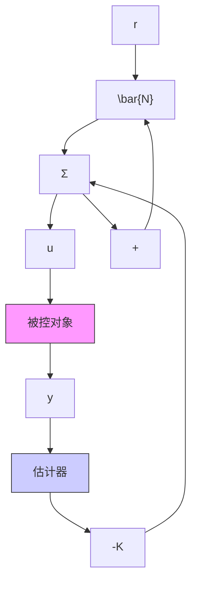
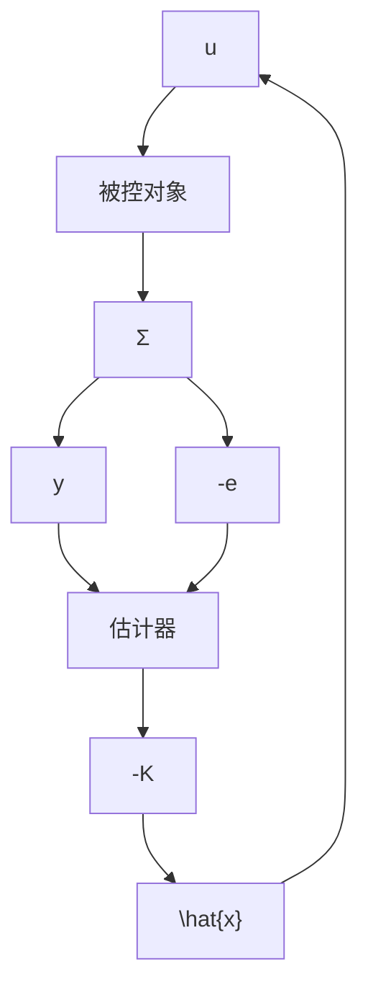

# 7.9.1 参考输入的一般结构

给定参考输入 $r(t)$ ，将 $r$ 引入系统方程组的最一般的线性方式是在控制器方程组中加入与 $r$ 成正比的项。这可以通过将 $\overline{N} r$ 加到式(7.184b)和将 $M r$ 加到式(7.184a)来实现。注意，在这种情况下， $\overline{N}$ 为标量， $M$ 为 $n \times 1$ 的矢量。加入这些项后，控制器方程变为

$$\dot {\hat {x}} = (A - B K - L C) \hat {x} + L y + M r \tag {7.185a}u = - \mathbf {K} \hat {\mathbf {x}} + \overline {{{N}}} r \tag {7.185b}$$

框图如图 7.48a 所示。图 7.47 给出了相应于 M 和 $\overline{N}$ 取不同值时的另一种形式。由于 $r(t)$ 为外部信号，很明显，M 和 $\overline{N}$ 都不能影响控制器-估计器组成的复合系统的特征方程。就传递函数而言，M 和 $\overline{N}$ 的选择只会影响从 r 到 y 的传输零点，因此，会很大程度上影响暂态性能而非稳定性。那么，应该如何选取 M 和 $\overline{N}$ 得到满意的暂态响应呢？需要指出的是，我们已经通过反馈增益 K 和 L 分配了系统极点，现在将利用前馈增益 M 和 $\overline{N}$ 来分配零点。

选取 M 和 $\overline{N}$ 有三种策略。

(1) 自治估计器：选择 M 和 $\overline{N}$ ，使得状态估计器的误差方程与 r 无关（见图 7.48b）。  
（2）跟踪误差估计器：选择 M 和 $\overline{N}$ 使得在控制中仅使用跟踪误差 $e=(r-y)$ （见图 7.48c）。  
（3）零点配置估计器：选择 M 和 $\overline{N}$ 使得整个传递函数的 n 个零点全部位于设计者指定位置（见图 7.48a）。

flowchart

a) 一般情况-零点配置

flowchart

b) 标准情况-估计器无激励，零点= $\alpha_{e}(s)$   

flowchart

c) 误差控制情况-经典补偿  
图 7.48 引入参考输入的几种方式

情形1：从估计器性能角度来看，第一种方法非常有吸引力而且是最为广泛应用的可选方案。如果 $\hat{x}$ 产生 $x$ 的有效估计，那么 $\tilde{x}$ 一定要尽可能地避免受外部激励；即从 $r$ 看去， $\tilde{x}$ 应是不可控的。计算 $M$ 和 $\overline{N}$ 来实现这一点是十分容易的。用式(7.183a)减去式(7.185a)，将被控对象输出方程[式(7.183a)]代入估计器方程[式(7.184a)]，将控制方程[式(7.184b)]代入被控对象方程[式(7.183a)]，得到估计器误差方程为
