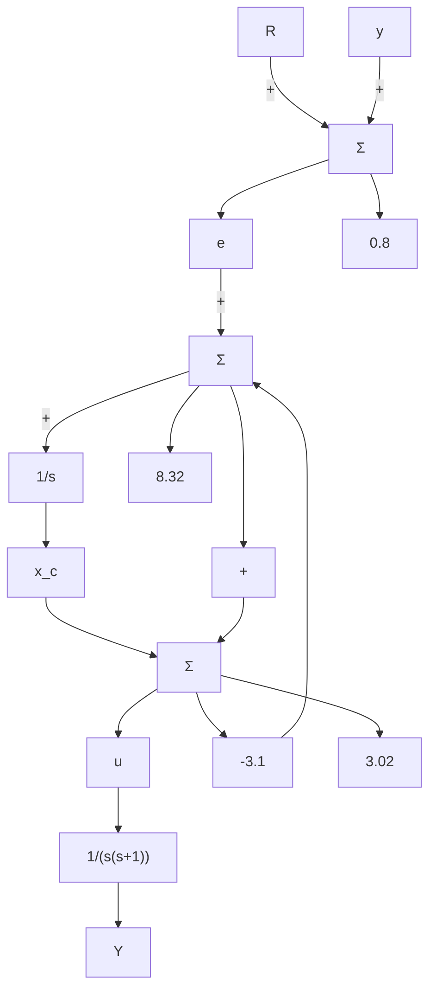

# 例7.33 伺服机构：通过零点配置提高速度常数

考虑如下描述的二阶伺服机构系统：

$$G (s) = \frac {1}{s (s + 1)}$$

其状态描述为

$$\dot {x} _ {1} = x _ {2}\dot {x} _ {2} = - x _ {2} + u$$

使用极点配置方法设计控制器，使得两个极点均位于 s = -2，系统速度常数为 $K_{v} = 10s^{-1}$ 。通过阶跃响应和控制作用画图证明设计的有效性。解的离散形式参见附录 W7.9，网址 www.fpe7e.com 可供参考及查询。

解答。对于这一问题，状态反馈增益为

$$
\boldsymbol {K} = \left[ \begin{array}{l l} 8 & 3 \end{array} \right]
$$

可得到期望的控制极点。在该增益下， $K_{v}=2s^{-1}$ ，而要求 $K_{v}=10s^{-1}$ 。根据选择M和N的三种方法设计估计器，会对我们的设计产生什么影响呢？第一种策略（自治估计器）可发现 $K_{v}$ 值不变。若用第二种方法（误差控制），引入一个位置事先未知的零点，该零点对 $K_{v}$ 的影响无法直接设计控制。然而，若我们使用第三种方法（零点配置）和特鲁赛尔公式[式(7.194)]，则动态响应与稳态需求均可满足要求。

针对 $K_{\mathrm{v}} = 10~\mathrm{s}^{-1}$ ，首先选择满足式(7.194)的估计器极点 $p_3$ 与零点 $z_{3}$ 。我们希望将 $z_{3} - p_{3}$ 保持很小，使得对动态响应只有很小的影响，但 $1 / z_{3} - 1 / p_{3}$ 的值可以大到使 $K_{\mathrm{v}}$ 的值增大。为实现上述目标，相对应控制系统动态特性，将 $p_3$ 设置成任意小。例如，令

$$p _ {3} = - 0. 1$$

注意，这种方法与通常需要快速响应的估计设计的原则相反。利用式(7.194)得到

$$\frac {1}{K _ {\mathrm{v}}} = \frac {1}{z _ {3}} - \frac {1}{p _ {1}} - \frac {1}{p _ {2}} - \frac {1}{p _ {3}}$$

其中： $p_1 = -2 + 2\mathrm{j}, p_2 = -2 - 2\mathrm{j}, p_3 = -0.1$ ，求解 $z_{3}$ 使得 $K_{\nu} = 10$ ，此时，有

$$\frac {1}{K _ {\mathrm{v}}} = \frac {4}{8} + \frac {1}{0 . 1} + \frac {1}{z _ {3}} = \frac {1}{1 0}$$

或

$$z _ {3} = - \frac {1}{1 0 . 4} = - 0. \dot {0} 9 6$$

我们设计一个降阶估计器，使其极点位于-0.1处，选择 $M / \overline{N}$ 使得 $\gamma (s)$ 在一0.096处有一个零点。所得系统框图如图7.49(a)所示。很容易验证，对于特定的，系统的整个传递函数为

$$\frac {Y (s)}{R (s)} = \frac {8 . 3 2 (s + 0 . 0 9 6)}{(s ^ {2} + 4 s + 8) (s + 0 . 1)} \tag {7.195}$$

$K_{v}=10s^{-1}$ ，符合要求。

图 7.49a 所示的补偿有两种输入 (e 和 y)，一个输出，在某种意义上来说，这是一个非经典补偿。如果我们通过找到从 e 和 u 的传递函数来求解这些方程，以提供纯误差补偿，得到式 (7.195)，可获得如图 7.49b 所示的系统。如下所见，相关控制器方程为

$$\dot {x} _ {\mathrm{c}} = 0. 8 e - 3. 1 uu = 8. 3 2 e + 3. 0 2 y + x _ {c}$$

其中： $x_{c}$ 为控制器的状态。对这些方程取拉普拉斯变换，消去 $X_{c}(s)$ 项，并将输出用 $[Y(s)=G(s)U(s)]$ 代换，可以求出补偿器为

$$\frac {U (s)}{E (s)} = D _ {\mathrm{c}} (s) = \frac {(s + 1) (8 . 3 2 s + 0 . 8)}{(s + 4 . 0 8) (s + 0 . 0 1 9 6)}$$

flowchart

a) 双输入补偿器
