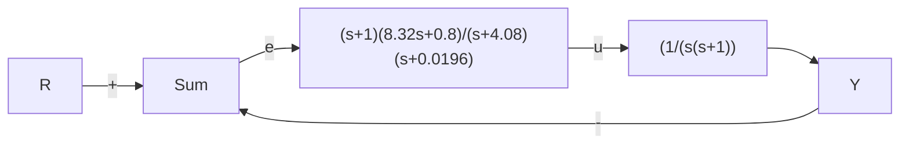

flowchart

b) 等效单位反馈系统  
图 7.49 具有配置零点的伺服机构(滞后网络)

这种补偿为经典的滞后-超前网络。图7.49b所示系统的根轨迹如图7.50所示。注意原点附近的零极点分布(模式)具有滞后网络的特性。图7.51所示的伯德图表明，系统在低频段有滞后相位，在高频有超前相位。该系统的阶跃响应如图7.52a所示，可以看到由于慢极点-0.1使得响应曲线出现“尾部”。相应的控制作用如图7.52所示。当然，该系统为1型系统，而且最终跟踪误差将为零。

scatter

| Re(s) | Im(s) |
| --- | --- |
| -1 | 0.12 |
| -0.08 | 0.08 |
| -0.16 | 0.08 |
| -0.24 | 0.12 |

图 7.50 滞后-超前补偿系统的根轨迹

line

| ω/(rad/s) | 幅值 |
| --- | --- |
| 0.01 | 1000 |
| 0.1 | 100 |
| 1 | 1 |
| 2 | 0.1 |
| 4 | 0.01 |
| 10 | 0.001 |
| 40 | 0.0001 |
| 100 | 0.0001 |

a)   

line

| ω/(rad/s) | 相位 |
| --- | --- |
| 0.01 | -120° |
| 0.1 | -130° |
| 0.4 | -110° |
| 1 | -120° |
| 46 | -150° |
| 100 | -180° |

b)   
图 7.51 滞后-超前补偿系统的频率响应

line

| 时间/s | y |
| --- | --- |
| 0 | 0.0 |
| 1 | 1.0 |
| 2 | 1.05 |
| 3 | 1.02 |
| 4 | 1.01 |
| 5 | 1.0 |

line

| 时间/s | u |
| --- | --- |
| 0 | 8.0 |
| 0 | -1.0 |
| 0 | 0.0 |
| 0 | 0.0 |

图 7.52 滞后补偿系统的响应

现在，重新考虑前两个选择 M 和 $\overline{N}$ 的方法，从零点的角度来分析它们的含义。在第一种方法（自治估计器）下，令 $M = B\overline{N}$ ，将其代入到式(7.192)中，求控制器前馈零点，满足

$$\det (s \boldsymbol {I} - \boldsymbol {A} + \boldsymbol {L C}) = 0 \tag {7.196}$$

通过这个方程选取 L，使得估计器方程的特征多项式等于 $\alpha_{e}(s)$ 。因此，我们已经造出了 n 个零点，它们与估计器的 n 个极点恰好位于相同位置上。由于零极点对消的现象（导致估计器状态不可控性），整个传递函数极点只包含状态反馈控制器极点。

第二个方法(跟踪误差估计器)选取 M = -L， $\overline{N} = 0$ 。如果将这些条件代入式(7.191)，那么，前馈零点由下式给出：

$$
\det \left[ \begin{array}{c c} s I - A + B K + L C & L \\ - K & 0 \end{array} \right] = 0 \tag {7.197}
$$

上式最后一列右乘 C，并从前 n 列中减去这一结果，然后，在最后一行左乘 B，并将结果加到前 n 行上，式(7.197)可简化为
