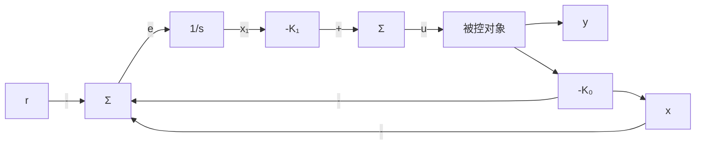

# 7.10.1 积分控制

首先，通过具有积分动态的扩维状态矢量，给出积分控制的特定解决方案。对于系统

$$\dot {\boldsymbol {x}} = \boldsymbol {A} \boldsymbol {x} + \boldsymbol {B} u + \boldsymbol {B} _ {1} w \tag {7.203a}y = C x \tag {7.203b}$$

通过给被控对象增加额外(积分)状态 $x_{1}$ ，将误差 $e=y-r$ 进行积分，并将该积分以及被控对象的状态 x 反馈回来，其中， $x_{1}$ 服从如下微分方程：

$$\dot {x} _ {\mathrm{I}} = \mathbf {C x} - r (= e)$$

因此

$$x _ {1} = \int^ {t} e (\tau) \mathrm{d} \tau$$

增广状态方程为

$$
\left[ \begin{array}{l} \dot {x} _ {\mathrm{I}} \\ \dot {x} \end{array} \right] = \left[ \begin{array}{l l} 0 & C \\ \mathbf {0} & A \end{array} \right] \left[ \begin{array}{l} x _ {\mathrm{I}} \\ x \end{array} \right] + \left[ \begin{array}{l} 0 \\ B \end{array} \right] u - \left[ \begin{array}{l} 1 \\ \mathbf {0} \end{array} \right] r + \left[ \begin{array}{l} 0 \\ B _ {1} \end{array} \right] w \tag {7.204}
$$

反馈律为

$$
u = - \left[ K _ {1} \quad K _ {0} \right] \left[ \begin{array}{c} x _ {1} \\ x \end{array} \right]
$$

或简写为

$$
u = - \mathbf {K} \left[ \begin{array}{c} x _ {1} \\ x \end{array} \right]
$$

有了这个系统的修正定义，我们就可以应用7.5节中给出的相似的设计方法；这样就得到了如图7.53所示的控制系统结构。

flowchart

图 7.53 积分控制结构
