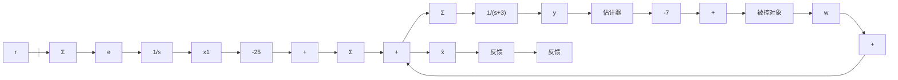

# 例 7.34 电动机速度系统的积分控制

考虑下式描述的电动机速度系统：

$$\frac {Y (s)}{U (s)} = \frac {1}{s + 3}$$

即有 A=-3, B=1，和 C=1。设计系统使其具有积分控制，且在 s=-5 处有两个极点。设计估计器，极点在 s=-10 处。扰动与控制量在相同位置进入系统。计算跟踪响应和抗扰动响应。

解答。要求的极点位置等价于

$$\mathrm{pc} = [ - 5; - 5 ]$$

包含扰动 w 的增广系统为

$$
\left[ \begin{array}{l} \dot {x} _ {1} \\ x \end{array} \right] = \left[ \begin{array}{c c} 0 & 1 \\ 0 & - 3 \end{array} \right] \left[ \begin{array}{l} x _ {1} \\ x \end{array} \right] + \left[ \begin{array}{l} 0 \\ 1 \end{array} \right] (u + w) - \left[ \begin{array}{l} 1 \\ 0 \end{array} \right] r
$$

因此，由下式，我们可以找到 K:

$$
\det \left(s I - \left[ \begin{array}{c c} 0 & 1 \\ 0 & - 3 \end{array} \right] + \left[ \begin{array}{l} 0 \\ 1 \end{array} \right] K\right) = s ^ {2} + 1 0 s + 2 5
$$

或者

$$s ^ {2} + (3 + K _ {0}) s + K _ {1} = s ^ {2} + 1 0 s + 2 5$$

因此，

$$
\boldsymbol {K} = \left[ \begin{array}{l l} K _ {1} & K _ {0} \end{array} \right] = \left[ \begin{array}{l l} 2 5 & 7 \end{array} \right]
$$

用 acker 函数可以验证该结果。系统如图 7.54 所示，它具有几个反馈和一个扰动输入 w。

flowchart

图 7.54 积分控制示例

估计器增益 L=7 可由下式得到

$$\alpha_ {\mathrm{e}} (s) = s + 1 0 = s + 3 + L$$

估计器方程具有以下形式：

$$
\begin{array}{l} \dot {\hat {x}} = (A - L C) \hat {x} + B u + L y \\ = - 1 0 \hat {x} + u + 7 y \\ \end{array}
$$

且

$$u = - K _ {0} \hat {x} = - 7 \hat {x}$$

由阶跃参考输入 r 引起的阶跃响应 $y_{1}$ ，与由阶跃扰动输入 w 引起的输出扰动响应 $y_{2}$ 。如图 7.55a 所示，相应的控制作用 $(u_{1}$ 和 $u_{2})$ 如图 7.55b 所示。正如所期望的，系统为 1 型系统，它跟踪了阶跃参考输入信号而且渐近地抑制了阶跃扰动。

line

| 时间/s | y |
| --- | --- |
| 0.0 | 0.0 |
| 0.5 | 0.7 |
| 1.0 | 0.9 |
| 1.5 | 0.95 |
| 2.0 | 0.98 |
| 2.5 | 0.99 |
| 3.0 | 0.995 |
| 3.5 | 0.998 |
| 4.0 | 0.999 |
| 4.5 | 0.9995 |
| 5.0 | 1.0 |

a）阶跃响应

line

| 时间/s | u(t) |
| --- | --- |
| 0.0 | 0.0 |
| 0.5 | 3.2 |
| 1.0 | 3.0 |
| 1.5 | 3.0 |
| 2.0 | 3.0 |
| 2.5 | 3.0 |
| 3.0 | 3.0 |
| 3.5 | 3.0 |
| 4.0 | 3.0 |
| 4.5 | 3.0 |
| 5.0 | 3.0 |

b）控制作用  
图 7.55 电动机转速系统的暂态响应
