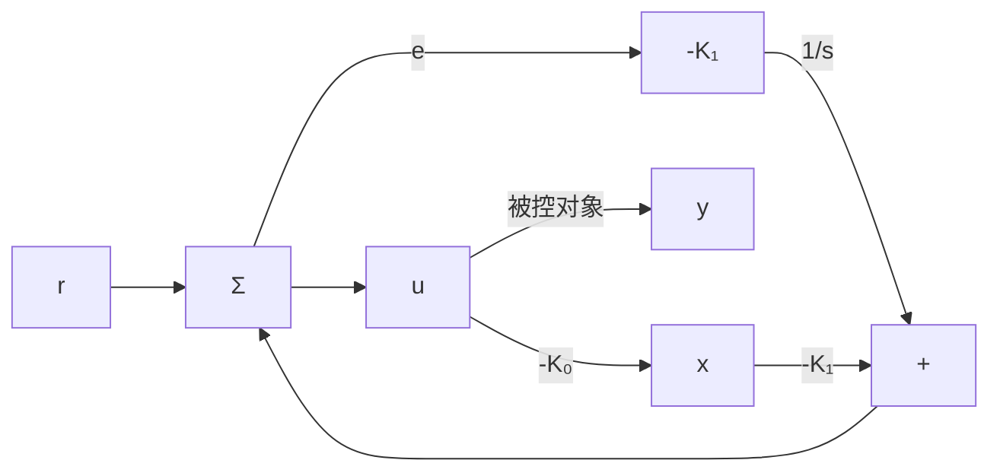

若误差系统 $(A_{s}, B_{s})$ 可控，那么用状态反馈可以使其具有任意动态特性。若被控对象 $(A, B)$ 可控，且它的零点与参考信号特征方程 $\alpha_{r}(s)=s^{2}+\alpha_{1}s+\alpha_{2}$ 的任意根均不相同，则误差系统 $(A_{s}, B_{s})$ 可控。 $^{①}$ 假定这些条件成立，则存在如下形式控制律：

$$
\mu = - \left[ \begin{array}{l l l} K _ {2} & K _ {1} & \mathbf {K} _ {0} \end{array} \right] \left[ \begin{array}{l} e \\ \dot {e} \\ \xi \end{array} \right] = - \mathbf {K z}. \tag {7.216}
$$

通过极点配置可以使得误差系统实现任意动态特性。现在，需要将这一控制律用实际过程状态 x 和实际控制量表示。将式(7.216)，式(7.210)与式(7.211)三式联立，得到用 u 和 x 表示的控制律（以下用 $u^{(2)}$ 表示 $\frac{d^{2}u}{dt^{2}}$ ）：

$$(u + \mathbf {K} _ {0} x) ^ {(2)} + \sum_ {i = 1} ^ {2} \alpha_ {i} (u + \mathbf {K} _ {0} x) ^ {(2 - i)} = - \sum_ {i = 1} ^ {2} K _ {i} e ^ {(2 - i)} \tag {7.217}$$

跟踪常值输入时，式(7.217)的实现结构很简单。在这种情况下，参考输入的方程为 $\dot{r}=0$ 。以u和x表示的控制律(式(7.217))简化为

$$\dot {u} + K _ {0} \dot {x} = - K _ {1} e \tag {7.218}$$

530

这时，只需对上式进行积分即可得到控制律，积分控制作用

$$u = - K _ {1} \int^ {t} e (\tau) \mathrm{d} (\tau) - K _ {0} x \tag {7.219}$$

该系统的框图如图 7.56 所示，从图中可以清楚看到控制器中存在一个纯积分器。在此情况下，图 7.56 所示的内模法与图 7.54 所示的特别方法之间的唯一差别在于积分器和增益的相对位置。

flowchart

图 7.56 使用内模的积分控制

为了清晰说明误差空间方法对鲁棒跟踪的能力，我们提出一个更复杂的问题：要求以零稳态误差跟踪正弦输入。例如，一个大容量磁盘头组装中的控制问题。
