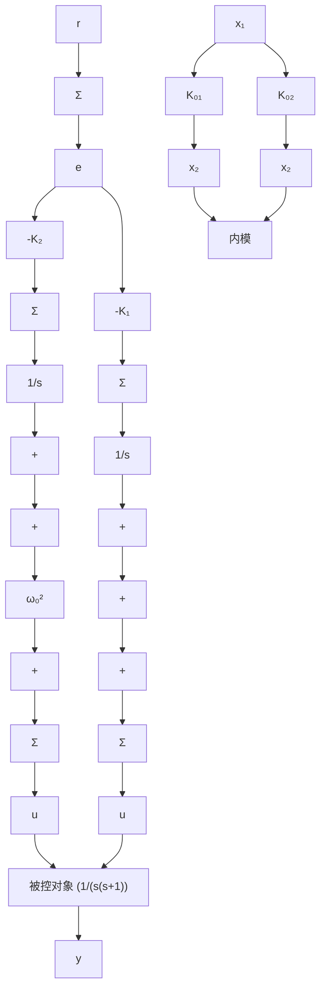

# 例 7.35 磁盘驱动伺服机构：跟踪正弦输入的鲁棒控制

一个简单的计算机磁盘驱动伺服机构的标称模型由下式给出：

$$
\begin{array}{l} \boldsymbol {A} = \left[ \begin{array}{c c} 0 & 1 \\ 0 & - 1 \end{array} \right], \quad \boldsymbol {B} = \left[ \begin{array}{l} 0 \\ 1 \end{array} \right] \\ \pmb {B} _ {1} = \left[ \begin{array}{l} 0 \\ 1 \end{array} \right], \quad \pmb {C} = \left[ \begin{array}{l l} 1 & 0 \end{array} \right], \quad J = 0 \\ \end{array}
$$

由于磁盘上的数据不完全在中心圆上，伺服系统必须跟踪一个角频率 $\omega_{0}$ 的正弦信号，其中， $\omega_{0}$ 是由轴速所决定的。

（1）给出系统控制器的结构，使得该系统以零稳态误差跟踪给定的参考输入。  
(2) 假定 $\omega_{0}=1$ ，期望闭环极点为 $-1\pm j\sqrt{3}$ 和 $-\sqrt{3}\pm j1$ 。  
(3) 用 Matlab 和 Simulink 验证该系统的跟踪特性和干扰抑制性能。

解答。

（1）参考输入满足微分方程 $\ddot{r} = -\omega_{0}^{2} r$ ，所以，有 $\alpha_{1} = 0$ 和 $\alpha_{2} = \omega_{0}^{2}$ 。有了这些值，根据式(7.215)可得误差—状态矩阵为

$$
\boldsymbol {A} _ {\mathrm{s}} = \left[ \begin{array}{c c c c} 0 & 1 & 0 & 0 \\ - \omega_ {0} ^ {2} & 0 & 1 & 0 \\ 0 & 0 & 0 & 1 \\ 0 & 0 & 0 & - 1 \end{array} \right] \quad \boldsymbol {B} _ {\mathrm{s}} = \left[ \begin{array}{l} 0 \\ 0 \\ 0 \\ 1 \end{array} \right]
$$

$A_{s}-B_{s}K$ 的特征方程为

$$s ^ {4} + (1 + K _ {0 2}) s ^ {3} + (\omega_ {0} ^ {2} + K _ {0 1}) s ^ {2} + [ K _ {1} + \omega_ {0} ^ {2} (1 + K _ {0 2}) ] s + K _ {0 1} \omega_ {0} ^ {2} K _ {2} = 0$$

根据上式用极点配置法选择增益。根据式(7.217)实现的补偿器如图7.57所示，从该图可以清楚地看到，在控制器中存在一个角频率为 $\omega_{0}$ 的振荡器（称为输入振荡器的内模）。

flowchart

图 7.57 伺服机构精确跟踪角频率为 $\omega_{0}$ 的正弦信号的补偿器结构

(2) 假设 $\omega_{0}=1rad/s$ ，期望闭环极点为

$$\mathrm{pc} = \left[ - 1 + \mathrm{j} * \sqrt {3}; - 1 - \mathrm{j} * \sqrt {3}; - \sqrt {3} + \mathrm{j}; - \sqrt {3} - \mathrm{j} \right]$$

那么，反馈增益为

$$\mathbf {K} = \left[ K _ {2} \quad K _ {1}: \mathbf {K} _ {0} \right] = \left[ 2. 0 7 1 8 \quad 1 6. 3 9 2 3: 1 3. 9 2 8 2 \quad 4. 4 6 4 1 \right]$$

由此得到控制器为
