flowchart

```mermaid
graph TD
    A["输入"] --> B["r"]
    B --> C["示波器2"]
    C --> D["工作空间1"]
    D --> E["e"]
    E --> F["工作空间2"]
    F --> G["示波器1"]
    G --> H["+"]
    H --> I["-1/s"]
    I --> J["积分器"]
    J --> K["1/s"]
    K --> L["积分器2"]
    L --> M["x2"]
    M --> N["积分器3"]
    N --> O["x1"]
    O --> P["显示器"]
    P --> Q["输出1"]
    Q --> R["y"]
    R --> S["工作空间1"]
    S --> T["+"]
    T --> U["-4.4641"]
    U --> V["增益2"]
    V --> W["-13.928"]
    W --> X["增益3"]
    X --> Y["+"]
    Y --> Z["-1"]
    Z --> AA["增益4"]
    AA --> AB["+"]
    AB --> AC["-2.0718"]
    AC --> AD["积分器"]
    AD --> AE["1/s"]
    AE --> AF["u"]
    AF --> AG["积分器2"]
    AG --> AH["x2"]
    AH --> AI["积分器3"]
    AI --> AJ["x1"]
```

图 7.60 鲁棒伺服机构 Simulink 框图

line

| x | y |
| --- | --- |
| 0 | 0.0 |
| 2 | 1.0 |
| 4 | -1.0 |
| 6 | 1.0 |
| 8 | -1.0 |
| 10 | 1.0 |
| 12 | -1.0 |
| 14 | 1.0 |
| 16 | -1.0 |
| 18 | 1.0 |
| 20 | -1.0 |
| 22 | 1.0 |
| 24 | -1.0 |

a）鲁棒伺服机构的跟踪特性

line

| Time (s) | Control量, u |
| --- | --- |
| 0 | 0 |
| 5 | 1.5 |
| 10 | -1.5 |
| 15 | 1.5 |
| 20 | -1.5 |
| 25 | 1.5 |

b）控制作用

line

| Time | 误差时信, e |
| --- | --- |
| 0 | 0.6 |
| 5 | -0.05 |
| 10 | 0.0 |
| 15 | 0.0 |
| 20 | 0.0 |
| 25 | 0.0 |

c）跟踪信号误差

图 7.61  

line

| x | y |
| --- | --- |
| 0 | 0.0 |
| 2 | 1.0 |
| 4 | -1.0 |
| 6 | 0.0 |
| 8 | 1.0 |
| 10 | -1.0 |
| 12 | 0.0 |
| 14 | 1.0 |
| 16 | -1.0 |
| 18 | 0.0 |
| 20 | 1.0 |
| 22 | -1.0 |
| 24 | 0.0 |

a）鲁棒伺服机构的扰动抑制性质

line

| Time (s) | Control量, u |
| --- | --- |
| 0 | 0 |
| 5 | -1 |
| 10 | 1 |
| 15 | -1 |
| 20 | 1 |
| 25 | -1 |

b）控制作用  
图 7.62

系统从 r 到 e 的零点位于 $\pm j$ ，-2.7321 $\pm j$ 2.5425。鲁棒跟踪性能是由于存在位于 $\pm j$ 处的阻塞零点。从 w 到 y 的零点位于 $\pm j$ ，均为阻塞零点。干扰抑止的鲁棒特性是由于存在这些阻塞零点。

由极点配置的本质可知，只要 $A_{s}-B_{s}K$ 保持稳定，对于系统参数的所有扰动，式(7.214)中所有状态 z 将趋于零。注意到被抑制的信号是那些满足这些方程的信号，方程中 $\alpha_{i}$ 的值实际上在外部信号模型中实现。该方法假设这些均为已知，且可精确实现。若这些实现的值有误，就会产生稳态误差。

line

| x | y |
| --- | --- |
| 10^-2 | -20 |
| 10^-1 | -15 |
| 10^0 | 0 |
| 10^1 | -35 |

ω/(rad/s)   

line

| x | 相位 (°) |
| --- | --- |
| 10^-2 | 0 |
| 10^-1 | 45 |
| 10^0 | -45 |
| 10^1 | -270 |

ω/(rad/s)   
图 7.63 鲁棒伺服机构的闭环频率响应

现在重新研究对于积分控制 7.10.1 小节中的例子。
