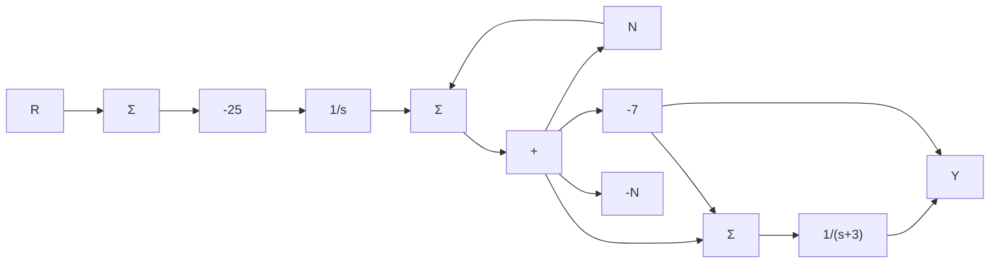
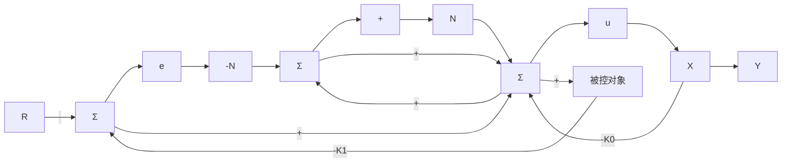

# 例7.36 用误差空间设计法实现的积分控制

对于系统

$$H (s) = \frac {1}{s + 3}$$

其状态变量描述为

$$A = - 3, \quad B = 1, \quad C = 1$$

为该系统构造一个极点为 s = -5 的控制器来跟踪满足 $\dot{r} = 0$ 的输入。

解答。误差空间系统为

$$
\left[ \begin{array}{c} \dot {e} \\ \dot {\xi} \end{array} \right] = \left[ \begin{array}{c c} 0 & 1 \\ 0 & - 3 \end{array} \right] \left[ \begin{array}{c} e \\ \xi \end{array} \right] + \left[ \begin{array}{c} 0 \\ 1 \end{array} \right] \mu
$$

其中：e=y-r， $\xi=\dot{x}$ ，和 $\mu=\dot{u}$ 。如果取期望的特征方程为

$$\alpha_ {c} (s) = s ^ {2} + 1 0 s + 2 5$$

那么， $K$ 的极点配置方程为

$$\det [ s \boldsymbol {I} - \boldsymbol {A} _ {\mathrm{s}} + \boldsymbol {B} _ {\mathrm{s}} \boldsymbol {K} ] = \alpha_ {\mathrm{c}} (s) \tag {7.220}$$

将式 $(7.220)$ 详细展开得

$$s ^ {2} + (3 + K _ {0}) s + K _ {1} = s ^ {2} + 1 0 s + 2 5$$

得到

$$
\mathbf {K} = \left[ \begin{array}{l l} 2 5 & 7 \end{array} \right] = \left[ \begin{array}{l l} K _ {1} & K _ {0} \end{array} \right]
$$

系统实现如图 7.64 所示。该系统从 r 到 e 的传递函数，即灵敏度函数为

$$\frac {E (s)}{R (s)} = \mathcal {S} (s) = - \frac {s (s + 1 0)}{s ^ {2} + 1 0 s + 2 5}$$

flowchart

图 7.64 具有前馈控制的内模示例

它有一个位于 s=0 的阻塞零点，该零点阻止了常值输入影响误差。闭环传递函数，即互补灵敏度函数为

$$\frac {Y (s)}{R (s)} = \mathcal {T} (s) = 1 - \mathcal {S} (s) = \frac {2 5}{s ^ {2} + 1 0 s + 2 5}$$

图 7.65 所示的结构中，允许我们加入参考输入的前馈，这给零点分配提供一个额外的自由度。若在式(7.219)加入一个与 r 成正比的项，则有

flowchart

图 7.65 具有前馈积分控制的内模

$$u = - K _ {1} \int^ {t} e (\tau) \mathrm{d} \tau - K _ {0} x + N r \tag {7.221}$$

这样，就产生了一个位于 $-K_{1}/N$ 的零点。通过选取这个零点的位置，可以改善系统的暂态响应。在实际实现中，可将式(7.221)改写成e的形式，即

$$u = - K _ {1} \int^ {t} e (\tau) \mathrm{d} \tau - K _ {0} x + N (y - e) \tag {7.222}$$

系统框图如图 7.65 所示。在例子中，总的传递函数变为

$$\frac {Y (s)}{R (s)} = \frac {N s + 2 5}{s ^ {2} + 1 0 s + 2 5}$$

注意到对于任意 N 值，直流增益均为 1，而且通过对 N 选择，可以将零点配置为能改善系统动态响应的任意实值。设置零点位置的一个策略是，让它与系统的某个极点相消，本例中取极点为 s = -5。对于 N = 5、0、8 的情况，系统的阶跃响应如图 7.66 所示。因为知道积分控制设计可以消去一个极点，所以一定可以选取一个期望控制极点，使其既为实数又能通过恰当的选择 N 的实现对消。
