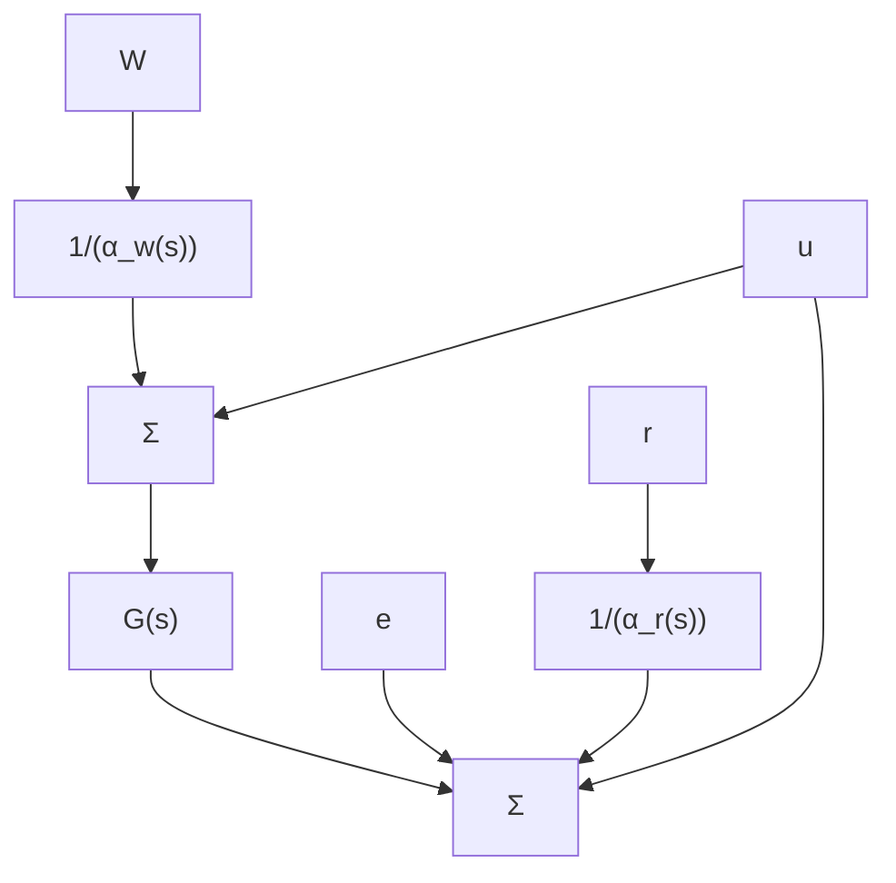
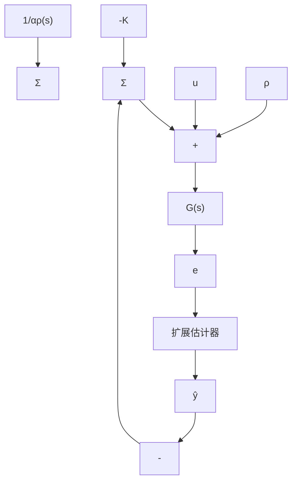

# △7.10.4 扩展估计器

目前为止，关于鲁棒控制的讨论是基于全状态反馈的控制系统进行的。若状态不可获得，则通常情况下，全状态反馈 $Kx$ 可用之前建立的状态估计器的状态估计 $K\hat{x}$ 进行代替。最后，研究使用外部输入的控制设计方法，本节，我们研究一种跟踪参考输入并且抑制干扰的设计方法。这一方法基于增广估计器，包含了对外部信号的估计，在此方式下可以消除外部信号对系统误差的影响。

假设被控对象由下式给出

$$\dot {x} = A x + B u + B w \tag {7.246a}y = \mathbf {C x} \tag {7.246b}e = \mathbf {C x} - r \tag {7.246c}$$

而且，假设参考信号 r 和干扰信号 w 已知，且满足下式 $^{①}$

$$\alpha_ {\mathrm{w}} (s) w = \alpha_ {\mathrm{p}} (s) w = 0 \tag {7.247}\alpha_ {r} (s) r = \bar {\alpha} _ {\rho} (s) r = 0 \tag {7.248}$$

其中：

$$\alpha_ {p} (s) = s ^ {2} + \alpha_ {1} s + \alpha_ {2}$$

在图 7.71a 中，上式对应的多项式为 $\alpha_{\mathrm{w}}(s)$ 和 $\alpha_{\mathrm{r}}(s)$ 。通常情况下，图 7.71b 中的等效扰动多项式 $\alpha_{\rho}(s)$ 选取为 $\alpha_{\mathrm{w}}(s)$ 和 $\alpha_{\mathrm{r}}(s)$ 的最小公倍数。第一步是意识到，就输出的稳态响应而言，存在一个等效输入信号 $\rho$ ，该信号满足 r 和 w 相同的方程，而且与图 7.71b 所示的类似，所给出的控制信号都是在相同位置进入系统的。像之前一样，必须假设被控对象的零点与式(7.247)任意一个根均不相等。为此，我们可以用下式代替方程组式(7.223):

$$\dot {\boldsymbol {x}} = \boldsymbol {A} \boldsymbol {x} + \boldsymbol {B} (u + \rho) \tag {7.249a}e = \mathbf {C x} \tag {7.249b}$$

flowchart

a) 等效干扰

flowchart

b) 设计框图

flowchart

