```mermaid
graph TD
    A["Σ"] --> B["+"]
    B --> C["Σ"]
    C --> D["G(s)"]
    D --> E["Σ"]
    E --> F["e"]
    F --> G["扩展估计器"]
    G --> H["-K"]
    H --> I["+"]
    I --> J["Σ"]
    J --> K["u"]
    K --> L["+"]
    L --> M["W"]
    M --> N["+"]
    N --> O["r"]
    O --> P["-"]
    P --> Q["e"]
    Q --> R["+"]
    R --> S["Σ"]
    S --> T["+"]
    T --> U["Σ"]
    U --> V["+"]
    V --> W["Σ"]
    W --> X["+"]
    X --> Y["Σ"]
    Y --> Z["e"]
    Z --> AA["+"]
    AA --> AB["Σ"]
    AB --> AC["+"]
    AC --> AD["Σ"]
    AD --> AE["+"]
    AE --> AF["Σ"]
    AF --> AG["e"]
    AG --> AH["+"]
    AH --> AI["Σ"]
    AI --> AJ["+"]
    AJ --> AK["Σ"]
    AK --> AL["e"]
    AL --> AM["+"]
    AM --> AN["Σ"]
    AN --> AO["e"]
    AO --> AP["Σ"]
    AP --> AQ["e"]
    AQ --> AR["+"]
    AR --> AS["Σ"]
    AS --> AT["e"]
    AT --> AU["+"]
    AU --> AV["Σ"]
    AV --> AW["e"]
    AW --> AX["Σ"]
    AX --> AY["e"]
    AY --> AZ["+"]
    AZ --> BA["Σ"]
    BA --> BB["e"]
    BB --> BC["Σ"]
    BC --> BD["e"]
    BD --> BE["Σ"]
    BE --> BF["e"]
    BF --> BG["e"]
    BG --> BH["Σ"]
    BH --> BI["e"]
    BI --> BJ["Σ"]
    BJ --> BK["e"]
    BK --> BL["e"]
    BL --> BM["Σ"]
    BM --> BN["e"]
    BN --> BO["Σ"]
    BO --> BP["e"]
    BP --> BQ["e"]
    BQ --> BR["e"]
    BR --> BS["e"]
    BS --> BT["e"]
    BT --> BU["Σ"]
    BU --> BV["e"]
    BV --> BW["Σ"]
    BW --> BX["e"]
    BX --> BY["Σ"]
    BY --> BZ["e"]
    BZ --> CA["e"]
    CA --> CB["e"]
    CB --> CC["e"]
    CC --> CD["e"]
    CD --> CE["e"]
    CE --> CF["e"]
    CF --> CG["e"]
    CG --> CH["e"]
    CH --> CI["e"]
    CI --> CJ["e"]
    CJ --> CK["e"]
    CK --> CR["e"]
    CR --> CS["e"]
    CS --> CT["e"]
    CT --> CU["e"]
    CU --> CV["e"]
    CV --> CW["e"]
    CW --> CX["e"]
    CX --> CY["e"]
    CY --> CZ["e"]
    CZ --> DA["e"]
    DA --> DB["e"]
    DB --> DC["e"]
    DC --> DV["e"]
    DV --> DW["e"]
    DW --> DX["e"]
    DX --> DWB["e"]
```

c) 实现框图  
图 7.71 带扩展估计器的用于跟踪与干扰抑制的系统框图

若能估计该等效输入，则可以给控制量加入一项 $-\hat{\rho}$ ，这样，将消掉真实干扰和参考输入的影响，而且使输出在稳态时能跟踪r。为此，结合式(7.223)与式(7.247)，得到一个状态描述形式为

$$\dot {z} = A _ {\mathrm{s}} z + B _ {\mathrm{s}} u \tag {7.250a}e = C _ {s} z \tag {7.250b}$$

其中： $z=\left[\rho\quad\dot{\rho}\quad x^{T}\right]^{T}$ 。矩阵为

$$
\mathbf {A} _ {\mathrm{s}} = \left[ \begin{array}{c c c} 0 & 1 & \mathbf {0} \\ - \alpha_ {2} & - \alpha_ {1} & \mathbf {0} \\ \mathbf {B} & \mathbf {0} & \mathbf {A} \end{array} \right], \quad \mathbf {B} _ {\mathrm{s}} = \left[ \begin{array}{c} 0 \\ 0 \\ \mathbf {B} \end{array} \right] \tag {7.251a}

\mathbf {C} _ {\mathrm{s}} = \left[ \begin{array}{l l l} 0 & 0 & \mathbf {C} \end{array} \right] \tag {7.251b}
$$

既然 u 不能影响 $\rho$ ，所以由式(7.251)给出系统是不可控的。然而，若 A 和 C 为可观测的，且如果系统(A, B, C)不具有零点，也就是式(7.247)的根，那么式(7.251)的系统将是可观测的，我们可以构造观测器计算被控对象的估计状态和 $\rho$ 的估计值。估计器方程为标准形式，但控制器则不然：
