# 例 7.38 通过扩展估计器实现电机速度系统的稳态跟踪和干扰抑制

电机转速系统中，构造一个估计器控制状态并消除输出的常值偏差，同时跟踪一个常值参考输入，该系统描述如下：

$$\dot {x} = - 3 x + u \tag {7.256a}y = x + w \tag {7.256b}\dot {w} = 0 \tag {7.256c}\dot {r} = 0 \tag {7.256d}$$

将控制极点置于 s = -5 处，两个扩展估计器的极点为 s = -15。

解答。首先，通过忽略等效干扰设计控制律。然而，通过观察注意到值为-2的增益将把单极点从-3移动到期望值-5，因此，K=2。增加等效外部输入 $\rho$ 的增广系统由下式给出，其中 $\rho$ 取代了实际扰动 $\omega$ 和参考输入r。

$$\dot {\rho} = 0\dot {x} = - 3 x + u + \rhoe = x$$

扩展估计器方程为

$$\dot {\hat {\rho}} = l _ {1} (e - \hat {x})\dot {\hat {x}} = - 3 \hat {x} + u + \hat {\rho} + l _ {2} (e - \hat {x})$$

由下式的特征方程得到估计器误差增益为 $L=\left[225\quad27\right]^{T}$ :

$$
\det \left[ \begin{array}{c c} s & l _ {1} \\ 1 & s + 3 + l _ {2} \end{array} \right] = s ^ {2} + 3 0 s + 2 2 5
$$

系统框图由图 7.72a 给出，对输入的阶跃响应如图 7.72b 所示，其中输入信号为控制指令 r（在 t=0s 处加入）和扰动 w（在 t=0.5s 进入）。

```mermaid
graph TD
    A["Σ"] --> B["+"]
    B --> C["Σ"]
    C --> D["1/(s+3)"]
    D --> E["Σ"]
    E --> F["e"]
    F --> G["+"]
    G --> H["Σ"]
    H --> I["+"]
    I --> J["Σ"]
    J --> K["+"]
    K --> L["Σ"]
    L --> M["+"]
    M --> N["Σ"]
    N --> O["+"]
    O --> P["Σ"]
    P --> Q["+"]
    Q --> R["Σ"]
    R --> S["+"]
    S --> T["Σ"]
    T --> U["+"]
    U --> V["Σ"]
    V --> W["+"]
    W --> X["Σ"]
    X --> Y["+"]
    Y --> Z["Σ"]
    Z --> A
    style A fill:#f9f,stroke:#333
    style B fill:#ccf,stroke:#333
    style C fill:#cfc,stroke:#333
    style D fill:#fcc,stroke:#333
    style E fill:#cff,stroke:#333
    style F fill:#ffc,stroke:#333
    style G fill:#fcc,stroke:#333
    style H fill:#cfc,stroke:#333
    style I fill:#fcc,stroke:#333
    style J fill:#cfc,stroke:#333
    style K fill:#fcc,stroke:#333
    style L fill:#cfc,stroke:#333
    style M fill:#fcc,stroke:#333
    style N fill:#cfc,stroke:#333
    style O fill:#fcc,stroke:#333
    style P fill:#cfc,stroke:#333
    style Q fill:#fcc,stroke:#333
    style R fill:#cfc,stroke:#333
    style S fill:#fcc,stroke:#333
    style T fill:#cfc,stroke:#333
    style U fill:#fcc,stroke:#333
    style V fill:#cfc,stroke:#333
    style W fill:#fff,stroke:#000
```

flowchart

a）框图

line

| 时间/s | y | x̂ | ρ |
| --- | --- | --- | --- |
| 0.0 | 0.0 | -1.0 | -6.5 |
| 0.2 | 1.0 | -0.5 | -4.0 |
| 0.4 | 1.0 | 0.0 | -3.0 |
| 0.6 | 1.0 | 0.0 | -2.5 |
| 0.8 | 1.0 | 0.0 | -2.0 |
| 1.0 | 1.0 | 0.0 | -2.0 |
| 1.2 | 1.0 | 0.0 | -2.0 |
| 1.4 | 1.0 | 0.0 | -2.0 |
| 1.6 | 1.0 | 0.0 | -2.0 |
| 1.8 | 1.0 | 0.0 | -2.0 |
| 2.0 | 1.0 | 0.0 | -2.0 |

b）指令阶跃响应与干扰阶跃响应  
图 7.72 具有扩展估计器的电机转速系统
