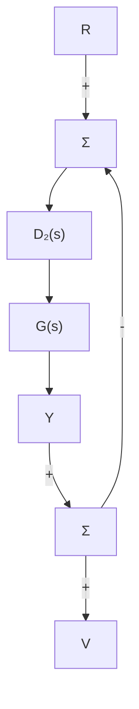
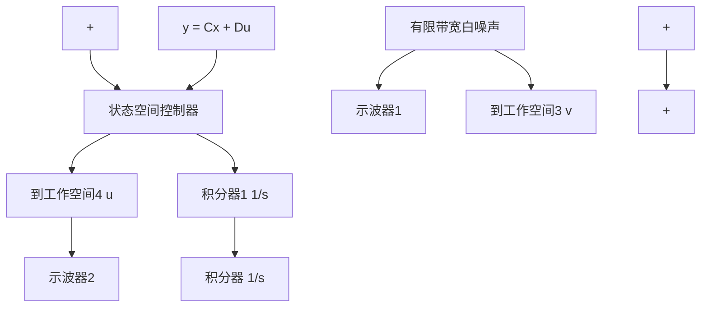

aa=A-B*K-L*C;
bb=L;
cc=K;
dd=0;
sysk=ss(aa,bb,cc,dd);
sysgk=series(sys0,sysk)
[maggk,phasgk,w]=bod
[gm,phm,wcg,wcp]=ma
loglog(w,[maggk1(:) ma
semilogx(w,[phasgk1(:) 
```

为了确定传感器噪声 v 对执行器行为的影响，先确定图 7.74 所示的从 v 到 u 的传递函数。对回路传递恢复法设计参数的选定值 q=10，有

$$
\begin{array}{l} \frac {U (s)}{V (s)} = H (s) = \frac {- D _ {\mathrm{c}} (s)}{1 + D _ {\mathrm{c}} (s) G (s)} \\ = \frac {- 1 5 5 . 5 6 s ^ {2} (s + 0 . 6 4 2 8)}{s ^ {4} + 1 5 . 5 5 6 s ^ {3} + 1 2 1 s ^ {2} + 1 5 5 . 5 6 s + 9 9 . 9 9 4} \\ \end{array}
$$

传感器噪声对执行器行为影响的一种合理度量方法是，采用控制量 u 的均方根(RMS)作为度量，u 是由外加噪声 v 引起的。控制量的 RMS 值可以按下式计算：

$$\left\| u \right\| _ {\mathrm{rms}} = \left(\frac {1}{T _ {\mathrm{o}}} \int_ {0} ^ {T _ {\mathrm{o}}} u (t) ^ {2} \mathrm{d} t\right) ^ {1 / 2} \tag {7.263}$$

其中： $T_{0}$ 为信号作用的时间。假设白色高斯噪声为 v，则控制量的 RMS 值也可解析地确定（伯德（Boyd）和巴拉特（Barratt），1991 年）。具有有限带


<details>
<summary>flowchart</summary>


</details>

图 7.74 回路传递恢复法设计的闭环系统

宽的传感器白噪声激励的闭环系统的 Simulink 示意图如图 7.75 所示。对于回路传递恢复法设计参数 q 的不同取值，用 Simulink 仿真可以计算出控制量的 RMS 值，这些值列在表 7.2 中。这些结果表明随着 q 值的增大，由执行器损耗引起的系统易损性也增加了。参见 Matlab 中用于回路传递恢复法计算的 ltry 和 ltru 命令。


<details>
<summary>flowchart</summary>


</details>

图 7.75 回路传递恢复法设计的 Simulink 框图

表 7.2 对回路传递恢复法调整参数 q 的不同取值计算出的 RMS 控制

<table><tr><td>q</td><td> $\parallel u\parallel_{\text{rms}}$ </td></tr><tr><td>1</td><td>0.1454</td></tr><tr><td>10</td><td>2.8054</td></tr><tr><td>100</td><td>70.5216</td></tr></table>
