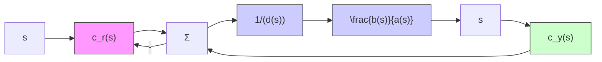

# △7.12 有理传递函数的直接设计

目前讨论的状态空间法的另一种可选方案是假设具有两个输入 $(r$ 和 $y)$ 一个输出 $(u)$ 的

一般结构的动态控制器，寻求控制器的传递函数，以得到指定的从 r 到 y 的总传递函数，这种情况的框图如图 7.76 所示。用如下传递函数建立被控对象的模型：

$$\frac {Y (s)}{U (s)} = \frac {b (s)}{a (s)} \tag {7.264}$$

而不是通过状态方程。控制器也根据传递

函数建模，这样，传递函数具有两个输入一个输出：

flowchart

图 7.76 直接传递函数的表述

$$U (s) = - \frac {c _ {\mathrm{y}} (s)}{d (s)} Y (s) + \frac {c _ {\mathrm{r}} (s)}{d (s)} R (s) \tag {7.265}$$

其中： $d(s)$ ， $c_{y}(s)$ 和 $c_{r}(s)$ 均为多项式。为了实现图 7.76 和式 (7.265) 给出的控制器，分子多项式 $c_{y}(s)$ 和 $c_{r}(s)$ 的阶数不应高于分母多项式 $d(s)$ 的阶数。

为了进行设计，要求由式(7.264)和式(7.265)定义的闭环传递函数应与下式的期望传递函数相匹配：

$$\frac {Y (s)}{R (s)} = \frac {c _ {\mathrm{r}} (s) b (s)}{\alpha_ {\mathrm{c}} (s) \alpha_ {\mathrm{e}} (s)} \tag {7.266}$$

式(7.266)说明被控对象的零点必须是整个系统的零点。改变这一情况的唯一途径是让 $b(s)$ 的因子出现在 $\alpha_{c}$ 或 $\alpha_{e}$ 中。联立式(7.264)和式(7.265)得到

$$a (s) Y (s) = b (s) \left[ - \frac {c _ {\mathrm{y}} (s)}{d (s)} Y (s) + \frac {c _ {\mathrm{r}} (s)}{d (s)} R (s) \right] \tag {7.267}$$

可改写为：

$$[ a (s) d (s) + b (s) c _ {\mathrm{y}} (s) ] Y (s) = b (s) c _ {\mathrm{r}} (s) R (s) \tag {7.268}$$

比较式(7.266)和式(7.267)即可看出，对于任意给定的 a、b、 $\alpha_{c}$ 和 $\alpha_{e}$ ，若能解出下述的丢番图方程，设计就完成了：

$$a (s) d (s) + b (s) c _ {\mathrm{y}} (s) = \alpha_ {\mathrm{c}} (s) \alpha_ {\mathrm{e}} (s) \tag {7.269}$$

由于每个传递函数都是多项式比的形式，因此，可以假设 $a(s)$ 和 $d(s)$ 为首一多项式；即在每个多项式中 $s$ 的最高次幂的系数均为1。问题是，如果将式(7.269)中的 $s$ 的相同次幂的系数相匹配，那么可得到多少方程和多少个未知数呢？如果 $a(s)$ 为 $n$ 阶(给定)的， $d(s)$ 为 $m$ 阶(待定)的，那么根据 $s$ 的幂的系数可得 $n + m$ 个方程，而在 $d(s)$ 和 $c_{y}(s)$ 中有 $2m + 1$ 个未知数。

因此要求：

$$2 m + 1 \geqslant n + m$$

或

$$m \geqslant n - 1$$

解存在的一种可能性是选 $d(s)$ 为 $n$ 阶， $c_{y}(s)$ 为 $n - 1$ 阶的。在全阶估计器的状态空间设计中， $\alpha_{c} \alpha_{c}$ 为 $2n$ 阶的，故有 $2n$ 个方程和 $2n$ 个未知数。当且仅当 $a(s)$ 和 $b(s)$ 没有公因子时，相应的方程对于任意 $\alpha_{i}$ 才有解。 $^{\ominus}$
