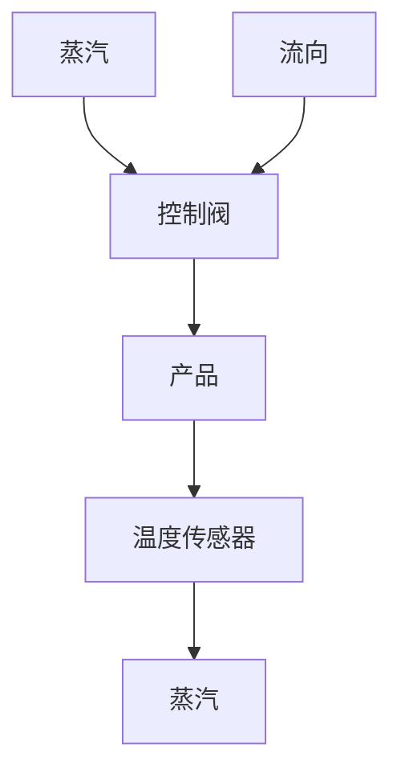
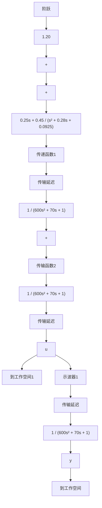

# 例 7.42 热交换器：具有纯滞后的设计

图 7.78 给出了例 2.15 中的热交换器图。通过控制交换器套管中蒸汽的流动速率来控制该产品的温度。温度传感器位于蒸汽控制阀下游几米远处，该控制阀给模型引入了传输时延。适合于该系统的模型为：

flowchart

图 7.78 热交换器

$$G (s) = \frac {e ^ {- 5 s}}{(1 0 s + 1) (6 0 s + 1)}$$

用史密斯补偿器和极点配置法为热交换器设计一个控制器。控制极点选为

$$p _ {\mathrm{c}} = - 0. 0 5 \pm 0. 0 8 7 \mathrm{j}$$

558

估计器极点应在控制极点三倍的自然频率处：

$$p _ {\mathrm{e}} = - 0. 1 5 \pm 0. 2 6 \mathrm{j}$$

用 Simulink 对系统的响应进行仿真。

解答。选一组合适的状态方程：

$$
\begin{array}{l} \dot {x} (t) = \left[ \begin{array}{c c} - 0. 0 1 7 & 0. 0 1 7 \\ 0 & - 0. 1 \end{array} \right] x (t) + \left[ \begin{array}{c} 0 \\ 0. 1 \end{array} \right] u (t - 5) \\ y = \left[ \begin{array}{l l} 1 & 0 \end{array} \right] x \\ \lambda = 5 \\ \end{array}
$$

对于给定的控制极点位置，暂且忽略时滞。其状态反馈增益为

$$
\boldsymbol {K} = \left[ \begin{array}{l l} 5. 2 & - 0. 1 7 \end{array} \right]
$$

对于给定的估计器极点，可得全阶估计器的估计增益矩阵为

$$
\boldsymbol {L} = \left[ \begin{array}{c} 0. 1 8 \\ 4. 2 \end{array} \right]
$$

因此，控制器传递函数为

$$D _ {\mathrm{c}} (s) = \frac {U (s)}{Y (s)} = \frac {- 0 . 2 5 (s + 1 . 8)}{s + 0 . 1 4 \pm 0 . 2 7 \mathrm{j}}$$

如果将闭环直流增益调整为1，则有

$$\overline {{{N}}} = 1. 2 0 5 5$$

该系统的 Simulink $^{①}$ 框图如图 7.79 所示。系统的开环和闭环阶跃响应及控制作用如图 7.80 和图 7.81 所示，系统的根轨迹（无延迟）如图 7.82 所示。注意在图 7.80 和图 7.81 中，5s 的滞后对系统的响应来说是非常小的，本例中几乎无法察觉。

flowchart

图 7.79 热交换器的闭环 Simulink 图

line

| 时间/s | 温度输出,y (闭环) | 温度输出,y (开环) |
| --- | --- | --- |
| 0 | 0.0 | 0.0 |
| 50 | 1.2 | 0.4 |
| 100 | 1.0 | 0.8 |
| 150 | 1.0 | 0.9 |
| 200 | 1.0 | 0.95 |
| 250 | 1.0 | 0.98 |
| 300 | 1.0 | 1.0 |

图 7.80 热交换器的阶跃响应

line

| 时间/s | 控制,u |
| --- | --- |
| 0 | 6.8 |
| 25 | 0.0 |
| 50 | 1.2 |
| 100 | 1.0 |
| 150 | 1.0 |
| 200 | 1.0 |
| 250 | 1.0 |
| 300 | 1.0 |

图 7.81 热交换器的控制量

line

| Re (s) | Im (s) |
| --- | --- |
| -0.1 | 0.2 |
| -0.3 | 0.3 |
| -0.1 | -0.2 |
| 0.1 | -0.3 |

图 7.82 热交换器的根轨迹
