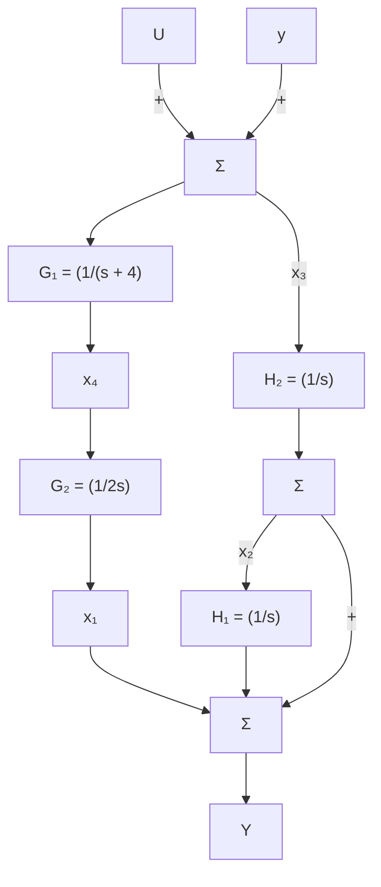

# 7.4节习题

7.3 给出下列传递函数的状态描述矩阵的能控标准形。

(a) $G(s)=\frac{1}{2s+1}$ ;

(b) $G(s)=\frac{6(s/3+1)}{(s/10+1)}$ ;

(c) $G(s)=\frac{8s+1}{s^{2}+3+2};$

(d) $G(s)=\frac{s+7}{s(s^{2}+2s+2)}$ ;

(e) $G(s)=\frac{(s+10)(s^{2}+s+25)}{s^{2}(s+2)(s^{2}+s+36)}$

7.4 用 Matlab 函数 tf2ss() 求习题 7.3 的状态矩阵。

7.5 用模态标准形给出习题 7.3 中传递函数的状态描述矩阵。通过把所有复共轭极点对放在一起确保状态矩阵的所有元素均为实值，将它们在能控标准形中以分离子块的形式实现。

7.6 某具有状态 x 的系统，其状态矩阵描述为：

$$
\boldsymbol {A} = \left[ \begin{array}{l l} - 2 & 1 \\ - 2 & 0 \end{array} \right], \quad \boldsymbol {B} = \left[ \begin{array}{l} 1 \\ 3 \end{array} \right],

\boldsymbol {C} = \left[ \begin{array}{l l} 1 & 0 \end{array} \right], \quad D = 0
$$

求变换矩阵 T，使得若 x=Tz，则描述 z 的动态特性的状态矩阵为能控标准形。计算新

的系统矩阵 $\overline{A}$ ， $\overline{B}$ ， $\overline{C}$ 和 $\overline{D}$ 。

7.7 证明状态的线性变换不会改变传递函数。

7.8 用框图化简法或梅森公式法找出图 7.31 所示的能观标准形系统的传递函数。

7.9 假定给出系统的状态矩阵为 A, B, C(此处 D=0)。求出变换阵 T，使得利用式(7.21)和式(7.22)得到新状态描述矩阵为能观标准形。

7.10 利用式(7.38)给出的变换阵将例 7.9 最后的方程显式展开。

7.11 求出状态变换阵，将式(7.32)的能观标准形化为模态标准形。

7.12 (a) 求变换阵 T，使例 7.10 中的磁带驱动器系统的描述为模态标准形，且将输入矩阵 $B_{m}$ 的每一个元素均化为 1。

(b) 用 Matlab 验证该变换阵满足要求。

7.13 (a) 求状态变换，使得例 7.10 的磁盘驱动器系统的描述为模态标准形，且使得在 $A_{\mathrm{m}}$ 中的极点以幅值增大的顺序排列。

(b) 用 Matlab 验证(a)的结果并给出全新的状态矩阵集 $\overline{A}$ ， $\overline{B}$ ， $\overline{C}$ 和 $\overline{D}$ 。

7.14 用式(7.55)求式(7.14a)中模态标准形矩阵 $A_{m}$ 的特征方程。

7.15 已知如下系统：

$$
\dot {\boldsymbol {x}} = \left[ \begin{array}{c c} - 5 & 1 \\ - 2 & - 1 \end{array} \right] \boldsymbol {x} + \left[ \begin{array}{l} 0 \\ 1 \end{array} \right] \boldsymbol {u}
$$

具有 0 初始状态，对阶跃输入 u 求 x 的稳态值。

7.16 考虑如图 7.85 所示的系统。

(a) 求从 U 到 Y 的传递函数。

(b) 用给定的状态变量写出系统的状态方程。

7.17 用给定的状态变量写出如图 7.86 所示的每个系统的状态方程。用框图变换和矩阵代数两种方法，求出每个系统的传递函数[同式(7.45)]。

7.18 用能控和能观标准形，写出以下传递函数的状态方程。画出每种情况的框图，并给出 A, B 和 C 的适当表达式。

(a) $G(s)=\frac{s^{2}-2}{s^{2}(s^{2}-1)}$ （用力对小车上的倒立摆进行控制）；

(b) $G(s)=\frac{3s+4}{s^{2}+2s+2}$

flowchart

图7.85 习题7.16的框图

