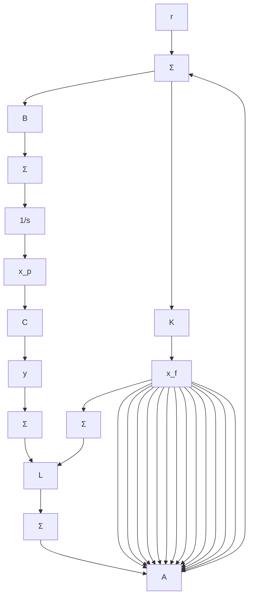

图7.91 习题7.38的框图

(c) 从系统时间常数的角度解释(b)问中求出的条件。  
(d) 求出该系统的传递函数。证明对于(b)问中导出的条件(即系统何时不可控或何时不可观测)存在零极点对消现象。

text_image

y(t)
+
C
+
x₁
-
L
↓x₂
u(t)
~
-
R₁
R₂

图 7.92 习题 7.39 的电路

7.40 卫星运动的线性化方程为

$$
\begin{array}{l} \dot {x} = A x + B u \\ y = C x \\ \end{array}
$$

其中：

$$
\begin{array}{l} \mathbf {A} = \left[ \begin{array}{c c c c} 0 & 1 & 0 & 0 \\ 3 \omega^ {2} & 0 & 0 & 2 \omega \\ 0 & 0 & 0 & 1 \\ 0 & - 2 \omega & 0 & 0 \end{array} \right], \quad \mathbf {B} = \left[ \begin{array}{c c} 0 & 0 \\ 1 & 0 \\ 0 & 0 \\ 0 & 1 \end{array} \right] \\ \boldsymbol {C} = \left[ \begin{array}{c c c c} 1 & 0 & 0 & 0 \\ 0 & 0 & 1 & 0 \end{array} \right], \quad \boldsymbol {u} = \left[ \begin{array}{l} u _ {1} \\ u _ {2} \end{array} \right], \quad \boldsymbol {y} = \left[ \begin{array}{l} y _ {1} \\ y _ {2} \end{array} \right] \\ \end{array}
$$

输入 $u_{1}$ 和 $u_{2}$ 为径向和切向压力，状态变量 $x_{1}$ 和 $x_{3}$ 为相对参考（圆形）轨道的径向偏移和角度偏移，输出 $y_{1}$ 和 $y_{2}$ 分别为半径和角度的测量值。

(a) 证明：两个控制输入都使用时，系统是可控的。  
(b) 证明：仅使用一个输入时，系统是可控的。它是哪个输入？  
(c) 证明：两个测量值都使用时，系统是可观测的。  
(d) 证明：仅使用一个测量值时，系统是可观测的，它是哪个测量值？

7.41 考虑如图 7.93 所示系统。

text_image

k
θ₁
F
M
喷气嘴
K=kd
θ̇₁=-ω²θ₁-K(θ₁-θ₂)+F/ml
θ̇₂=-ω²θ₂+K(θ₁-θ₂)-F/ml
d
g

图7.93 习题7.41的耦合摆

(a) 写出该系统的状态方程，用 $\left[\theta_{1}\theta_{2}\dot{\theta}_{1}\dot{\theta}_{2}\right]^{T}$ 作为状态矢量，F 作为单输入。  
(b) 证明：仅使用 $\theta_{1}$ 测量值时，所有的状态变量都是可观测的。  
(c) 证明：系统的特征多项式为两个振荡器多项式的乘积。证明时先写出包含如下状态变量的一组新系统方程。

$$
\left[ \begin{array}{l} y _ {1} \\ y _ {2} \\ \dot {y} _ {1} \\ \dot {y} _ {2} \end{array} \right] = \left[ \begin{array}{l} \theta_ {1} + \theta_ {2} \\ \theta_ {1} - \theta_ {2} \\ \dot {\theta} _ {1} + \dot {\theta} _ {2} \\ \dot {\theta} _ {1} - \dot {\theta} _ {2} \end{array} \right]
$$

提示：若 A 和 D 是可逆矩阵，则有
