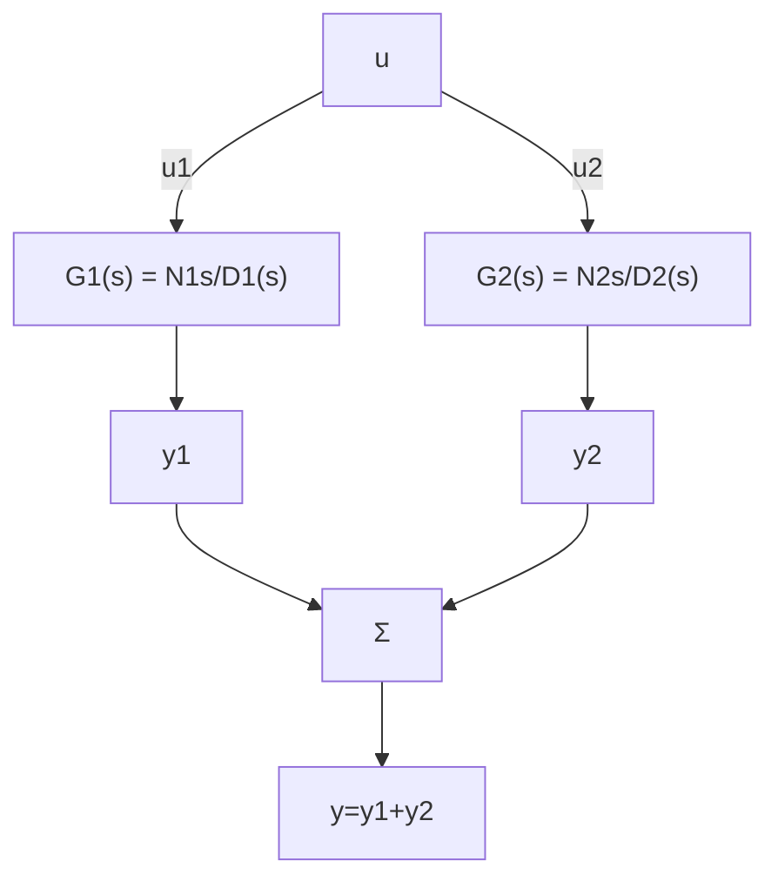
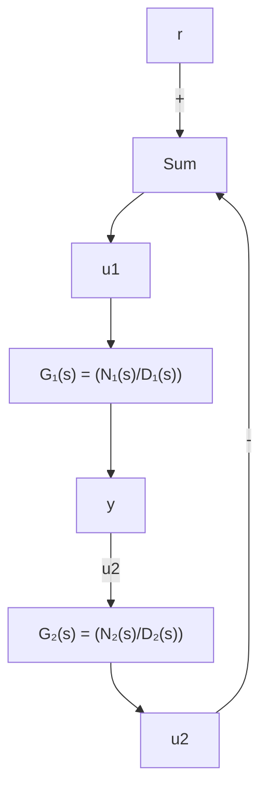

$$
\left[ \begin{array}{c c} \boldsymbol {A} & \boldsymbol {0} \\ \boldsymbol {0} & \boldsymbol {D} \end{array} \right] ^ {- 1} = \left[ \begin{array}{c c} \boldsymbol {A} ^ {- 1} & \boldsymbol {0} \\ \boldsymbol {0} & \boldsymbol {D} ^ {- 1} \end{array} \right]
$$

(d) 推导弹簧的状态对 F 是可控的，单摆的状态对 F 是不可控的。

7.42 某五阶系统特征方程的根为 0、-1、-2 和 $-1 \pm 1j$ 。将系统分解为可控部分和不可控部分时，可控部分特征方程的根为 0 和 $-1 \pm 1j$ 。将系统分解为可观测部分和不可观测部分时，可观测部分的模态为 0、-1 和 -2。

(a) 该系统 $b(s)=\text{Cadj}(sI-A)B$ 的零点位置在哪？

flowchart

a) 串联

flowchart

b) 并联

flowchart

c) 反馈  
图7.94 习题7.43的框图

(b) 仅包含可控和可观测模态的降阶传递函数的极点是什么？

7.43 考虑图 7.94 给出的串联、并联和反馈结构的系统。

(a) 假设每一个子系统都有如下的可控-可观测实现：

$$\dot {x} _ {i} = A x _ {i} + B _ {i} u _ {i}y _ {i} = C _ {i} x _ {i}$$

其中：i=1, 2，给出图 7.94 中各个复合系统的一组状态方程。

(b) 对每种情况，讨论要使每个系统可控且可观测，多项式 $N_{i}$ 和 $D_{i}$ 的根必须满足什么条件。从零极点对消的观点，简要解释一下你的答案。

7.44 考虑系统 $\ddot{y} + 3\dot{y} + 2y = \dot{u} + u$ 。

(a) 求出给定微分方程对应的能控标准形状态矩阵 $A_{c}$ ， $B_{c}$ 和 $C_{c}$ 。

(b) 在 $(x_{1}, x_{2})$ 平面，画出 $A_{c}$ 的特征矢量，并画出与完全可观测的状态变量 $(x_{0})$ 和完全不可观测的状态变量 $(x_{0})$ 对应的矢量。

(c) 用能观性矩阵 O 的形式表达 $x_{0}$ 和 $x_{0}^{-}$ 。

(d) 给出能观标准形状态矩阵，将可控性代替可观测性重复(b)问和(c)问。

7.45 同步卫星(如气象卫星)的运动方程为

$$\ddot {x} - 2 \omega \dot {y} - 3 \omega^ {2} x = 0, \quad \ddot {y} + 2 \omega \dot {x} = u$$

其中：x 为径向波动；y 为轴向位置波动；u 为 y 方向的引擎推力。

如图 7.95 所示，若运行与地球旋转同步，则 $\omega=2\pi/(3600\times24)\mathrm{rad/s}$ 。

(a) 状态 $x = \begin{bmatrix} x & \dot{x} & y & \dot{y} \end{bmatrix}^{T}$ 是可观测的吗?

(b) 选取 $x = [x \dot{x} y \dot{y}]^{T}$ 为状态矢量，y 为测量值，设计一个全阶观测器，

使极点配置到 $s = -2\omega$ 、 $-3\omega$ 和 $-3\omega \pm 3\omega j$ 。
