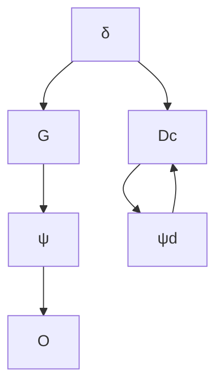

(a) 求出从 $\delta$ 到 $\psi$ 的传递函数，并给出该未受控船的特征根。  
(b) 用下述形式的全状态反馈：

$$\delta = - K _ {1} \beta - K _ {2} r - K _ {3} (\psi - \psi_ {\mathrm{d}})$$

其中， $\psi_{d}$ 为期望航向。试确定 $K_{1}$ 、 $K_{2}$ 和 $K_{3}$ 的值，使闭环极点配置到 s = -0.2, -0.2 ± 0.2j 上。

(c) 设计一个基于 $\psi$ 的测量值的状态估计器（例如， $\psi$ 可由陀螺仪测得）。将估计器误差方程的根配置到 s = -0.8 和 -0.8 ± 0.8j 上。  
(d) 给出如图 7.101 中补偿器 $D_{c}(s)$ 的状态方程和传递函数，并绘制出它的频率响应。

flowchart

图7.101 习题7.55中船的控制框图

(e) 绘制该闭环系统的伯德图并计算相应的增益裕度和相位裕度。  
(f) 计算参考输入的前馈增益并绘制航向角发生 $5^{\circ}$ 变化时系统的阶跃响应。
