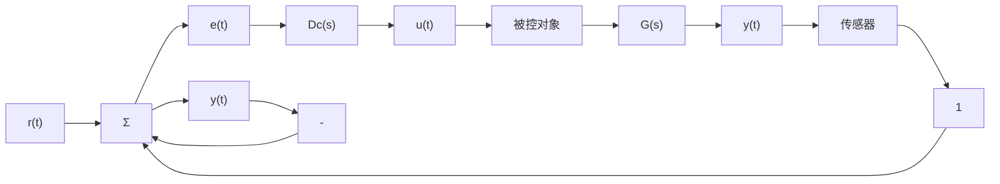
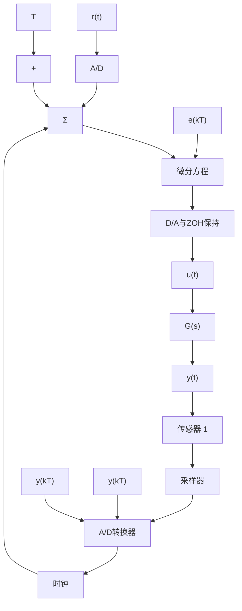

# 8.1 数字化

在前几章介绍的典型连续系统的拓扑结构图，如图8.1a所示。误差信号 $e$ 和控制器 $D_{\mathrm{c}}(s)$ 的计算都能在数字计算机中实现，其系统结构图如图8.1b所示。这两种实现间的根本区别在于：数字系统是对被控对象输出的采样值进行处理，而不是处理连续信号；由 $D_{\mathrm{c}}(s)$ 提供的连续控制，所含的任何积分和微分都必须在离散时间下产生，并通过差分方程的数值计算方法近似得到。因为计算机不能直接运行动态函数，所以这些方程都是代数递归方程。

细看整个过程，首先对象传感器的模拟输出被采样并通过模/数(A/D)转换器转换为一个数值。该设备对物理变量(大多数是电压信号)进行采样，然后将其转化成一个10位至16位的二进制数。这种从模拟信号 $y(t)$ 到采样值 $y(kT)$ 的转换每隔 $T$ 秒重复一次， $T$ 即为采样周期，1/T 为采样速率。如果 T 的单位为 s，则采样速率 1/T 的单位为 Hz，可用 $f_{s}$ 表示。采样后的信号为 $y(kT)$ ，其中 k 可取任意整数值。 $y(kT)$ 常简写为 $y(k)$ 。为了区别于时间域内的连续信号如 $y(t)$ ，我们称这种类型的变量为离散信号。一个兼有离散和连续信号的系统称作采样系统。

flowchart

a) 连续系统

flowchart

b) 带数字计算机的系统  
图 8.1 基本控制系统的框图

本书中我们假设采样周期是固定不变的。而实际上，数字控制系统的采样周期有时是变化的，且(或)在不同的反馈通路中采样周期也不相同。通常，计算机逻辑包含一个时钟，它每隔 $T$ 秒提供一个脉冲或中断，当中断到来时，A/D转换器就会向计算机发送一个数；另一种实现方法称为自行转换，它是在每个代码执行周期结束后访问A/D转换器。前一种情况中，采样周期是精确不变的；而后一种情况中，如果不存在可以改变执行代码数量的逻辑分支，采样周期实际上是由代码长度决定的。对于输入指令信号 $r(t)$ ，也可能由采样器和A/D转换器来产生离散的 $r(kT)$ ，将其减去测量输出 $y(kT)$ 就得到离散误差信号 $e(kT)$ 。

连续系统的控制器 $D_{\mathrm{c}}(s)$ 可以用差分方程近似，差分方程是微分方程的离散形式，如果采样速率足够快，它可以准确复制 $D_{\mathrm{c}}(s)$ 的动态特性。差分方程最后得到的是在每一个采样时刻的离散信号 $u(kT)$ 。这一信号可通过数/模(D/A)转换器转换成连续信号 $u(t)$ 并保持下来：D/A转换器可将二进制数转换成模拟电压值，而零阶保持器(ZOH)将该电压值保持一个采样周期。将得到的控制信号 $u(t)$ 加到执行机构上，施加的方式与连续实现时的完全相同。有两种基本技术来求取数字控制器的差分方程。一种技术称为离散化等效，该方法使用前几章介绍的方法设计一个连续控制器 $D_{\mathrm{c}}(s)$ ，然后用8.3节介绍的方法中的一种来近似该 $D_{\mathrm{c}}(s)$ 。另一种方法称作离散化设计，将在8.7节中介绍，这种方法可以不用预先设计 $D_{\mathrm{c}}(s)$ 而直接建立差分方程。

所需要的采样速率取决于系统的闭环带宽。通常，采样速率应至少为带宽的20倍以确保数字控制器与连续控制器的性能匹配。如果在数字控制器中做一些调整或接受某些性能上的退化，那么可以采用相对较低的采样速率。如果为了最小化硬件成本，那么可以运用允许更低采样速率的离散化设计法；但如果要获得一个数字控制器的最佳性能，则需要采样速率高于带宽的25倍。

值得注意的是，对实现控制系统数字化影响最大的是保持作用引起的延迟。因为每一个 $u(kT)$ 的值都要保持到计算机得到下一个 $u(kT)$ 值为止，如图 8.1b 所示，所以 $u(t)$ 的连续值是由一些阶梯组成的（见图8.2），这些常值经过平均后都是从 $u(kT)$ 开始延迟了T/2。如果将这T/2的延迟简单地纳入到系统的连续分析中，就可极好地预测当采样速率远低于20倍带宽时，采样结果对系统的影响。这些将在8.3.5小节中进一步讨论。
