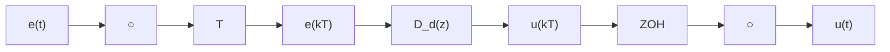

# 8.3 通过离散化等效进行设计

离散化等效设计，有时也称作仿真设计，其步骤如下。

（1）用第1章至第7章所学的内容设计一个连续控制器。  
(2) 找出能最好的近似连续控制器的离散化等效系统(通过图 8.1b 实现)。  
（3）用离散分析、仿真或者实验来验证设计的可行性。

假设已知如图8.1a所示的一个连续控制器 $D_{\mathrm{c}}(s)$ 。我们希望为图8.1b所示控制器的数字实现找到一组差分方程或 $D_{\mathrm{d}}(z)$ 。首先，把这个问题变为在图8.6a所示的数字实现中找到一个最佳的 $D_{\mathrm{d}}(z)$ 来匹配图8.6b中由 $D_{\mathrm{c}}(s)$ 表示的连续系统。接下来本节就来介绍解决上述问题的三种方法并对它们进行比较。

flowchart

a) 数字实现

  
b) 连续实现的对比  
图 8.6

重要的是要记住这些方法都是近似方法。因为 $D(s)$ 响应的是 $e(t)$ ，而 $D(z)$ 则仅仅响应采样值 $e(kT)$ ，因此并非对所有可能的输入都有精确的解。从某种意义上说，不同种类的数字化技术的区别仅仅是对采样点的 $e(t)$ 做了不同的假设。
