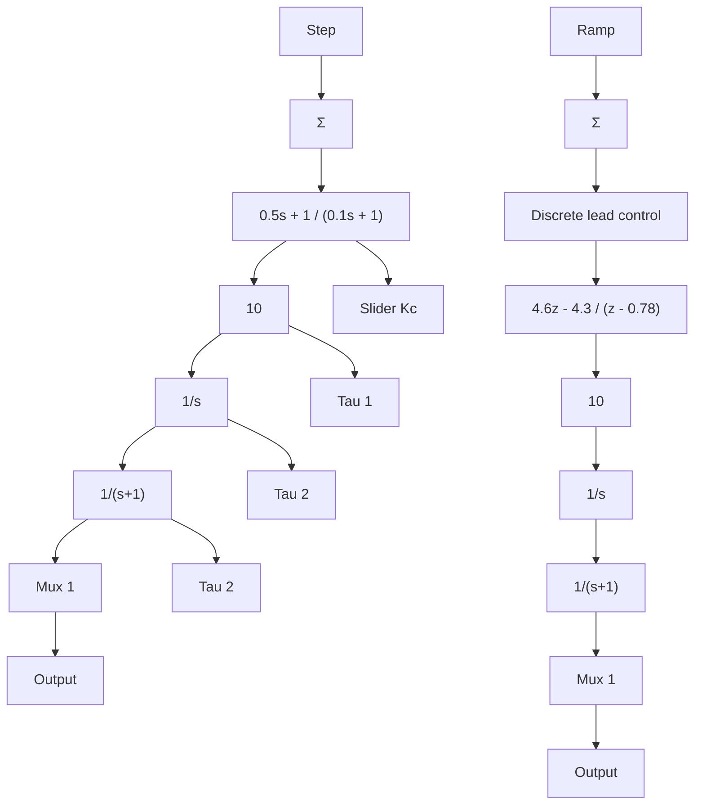

# 例 8.1 用图斯蒂近似法设计例 6.15 的数字控制器

用图斯蒂近似法确定差分方程来实现例 6.15 的控制器：

$$D _ {\mathrm{c}} (s) = 1 0 \frac {s / 2 + 1}{s / 1 0 + 1}$$

设采样速率为 25 倍的带宽，将其性能与例 6.15 中连续系统的性能进行比较。

解答。例 6.15 的带宽 $\omega_{BW}$ 大约为 10rad/s，通过观察可知穿越频率 $\omega_{c}$ 约为 5rad/s。注意到图 6.50 中 $\omega_{c}$ 与 $\omega_{BW}$ 之间的关系即可推导出 $\omega_{BW}$ 。因此，采样频率应为

$$\omega_ {\mathrm{s}} = 2 5 \times \omega_ {\mathrm{BW}} = 2 5 0 \mathrm{rad/s}$$

通常，当一种频率用 rad/s 或 Hz 表示时，则它可以用符号 f 代替；所以基于这一惯例可知：

$$f _ {\mathrm{s}} = \omega_ {\mathrm{s}} / (2 \pi) \approx 4 0 \mathrm{Hz} \tag {8.18}$$

则采样周期为

$$T = \frac {1}{f _ {\mathrm{s}}} = \frac {1}{4 0} \mathrm{s} = 0. 0 2 5 \mathrm{s}$$

离散控制器由下面的 Matlab 语句实现

$$
\begin{array}{l} s = t f \left(^ {\prime} s ^ {\prime}\right); \\ \text { sysDc } = \operatorname{tf} (1 0 ^ {*} (s / 2 + 1) / (s / 1 0 + 1); \\ T = 0. 0 2 5; \\ \text { sysDd } = \text { c2d(sysDc,T,'tustin') } \\ \end{array}
$$

执行上述 Matlab 语句得到

$$D _ {\mathrm{d}} (z) = \frac {4 5 . 5 6 - 4 3 . 3 3 z ^ {- 1}}{1 - 0 . 7 7 7 8 z ^ {- 1}} \tag {8.19}$$

通过观察式 $(8.19)$ ，可写出差分方程为

$$u (k) = 0. 7 7 7 8 u (k - 1) + 4 5. 5 6 e (k) - 4 3. 3 3 e (k - 1)$$

或

$$u (k) = 0. 7 7 7 8 u (k - 1) + 4 5. 5 6 [ e (k) - 0. 9 5 1 0 e (k - 1) ] \tag {8.20}$$

由式(8.20)可计算控制信号的当前值 $u(k)$ 、控制信号的前一时刻值 $u(k-1)$ ，以及误差信号的当前值与前一时刻值 $e(k)$ 和 $e(k-1)$ 。

原则上，差分方程是以 k=0 为初始值，然后依次估算 $k=1, 2, 3, \cdots$ 各时刻值的。但通常也没有必要把所有时刻的值都保留在内存中。因此，计算机仅需要为当前时刻和过去时刻定义变量值。用式(8.20)的差分方程实现图8.1b所示反馈环的计算机指令，需通过如下代码调用一个连续的循环：

$$
\begin{array}{l} \text { READ   A / D: } y, r \\ e = r - y \\ u = 0. 7 7 7 8 u _ {p} + 4 5. 5 6 [ e - 0. 9 5 1 0 e _ {p} ] \\ \text { OUTPUT   D / A: } u \\ u _ {p} = u (\text { 其   中 }, u _ {p} \text { 是   下   一   个   循   环   的   过   去   值 }) \\ e _ {p} = e \\ \end{array}
$$

当 T 运行结束回到 READ

使用 Simulink 比较两种实现的效果，并以此来评价上述离散控制器。仿真框图和阶跃响应对比图分别如图 8.8 和图 8.9 所示。值得注意的是，以 25 倍带宽的速率进行采样，能够使控制器的数字实现与连续控制器匹配得非常好。一般而言，如果希望连续系统与连续控制器的数字化近似相匹配，一个保守的方法就是以 25 倍带宽或更快的速率进行采样。

flowchart

图 8.8 带有控制器设计的离散和模拟实现的暂态响应仿真框图
