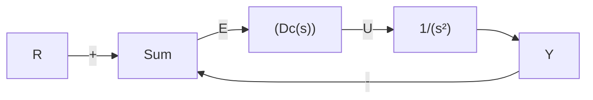
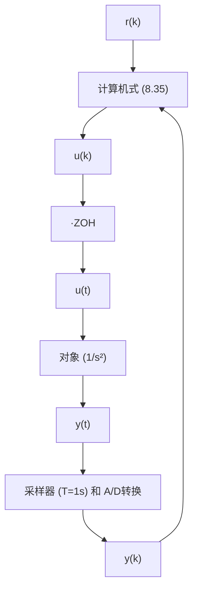

# 例 8.3 运用零极点匹配法对空间站姿态数字控制器进行仿真设计

空间站姿态控制动态系统的一个简化模型可写成

$$G (s) = \frac {1}{s ^ {2}}$$

设计一个数字控制器，其闭环自然频率为 $\omega_{n}\approx0.3rad/s$ ，阻尼比为 $\zeta=0.7$ 。

解答。首先要为图 8.11 所定义的系统找出一个合适的 $D_{c}(s)$ ，如图 8.11 所示。经过一些尝试发现，采用下式给出的超前控制器可满足指标要求：

$$D _ {\mathrm{c}} (s) = 0. 8 1 \frac {s + 0 . 2}{s + 2} \tag {8.33}$$

图 8.12 给出的根轨迹说明用式(8.33)给出的 $D_{c}(s)$ 是符合要求的。

为了数字化 $D_{c}(s)$ ，我们需要先选取一个采样速率。对于频率为 $\omega_{n}=0.3rad/s$ 的系统，带宽约为0.3rad/s，我们尝试选取比先前例子中稍微小些的采样速率，约为20倍的 $\omega_{n}$ ，有

$$\omega_ {\mathrm{s}} = 0. 3 \times 2 0 \mathrm{rad/s} = 6 \mathrm{rad/s}$$

6rad/s 的采样速率约为 1Hz；因此，采样周期应为 T=1s。由式(8.27)和式(8.28)可求出式(8.33)的 MPZ 数字化形式为

flowchart

图8.11 例8.3的连续设计定义

line

| Re (s) | Im (s) |
| --- | --- |
| -2 | -0.2 |
| -0.2 | -0.2 |
| 0 | -0.2 |
| 0 | 0 |

图 8.12 关于 K 的 s 平面根轨迹图

$$D _ {\mathrm{d}} (z) = 0. 3 8 9 \frac {z - 0 . 8 2}{z - 0 . 1 3 5} = \frac {0 . 3 8 9 - 0 . 3 1 9 z ^ {- 1}}{1 - 0 . 1 3 5 z ^ {- 1}} \tag {8.34}$$

609

观察式 $(8.34)$ 可得差分方程为

$$u (k) = 0. 1 3 5 u (k - 1) + 0. 3 8 9 e (k) - 0. 3 1 9 e (k - 1) \tag {8.35}$$

其中：

$$e (k) = r (k) - y (k)$$

这样数字算法设计就完成了。完整的数字系统如图 8.13 所示。

设计过程的最后一步是在计算机上实现该设计，以验证其合理性。图8.14所示的将 $T=1s(20\times\omega_{BW})$ 的数字系统的阶跃响应与连续控制器的阶跃响应进行了对比。值得注意的是，数字系统的超调量更大，这意味着数字实现

flowchart

图 8.13 对图 8.11 进行仿真得到的数字控制系统

时，需要减小阻尼。减小阻尼是因为系统有如图8.2所示的T/2的平均时延。为了更好地与连续系统匹配，可适当地增加采样速率。图8.14也给出了两倍于先前采样速率 $(40\times\omega_{BW})$ 的阶跃响应，可以看出它更加接近连续系统。值得注意的是，在更快的采样速率下，离散化控制器也需要根据式(8.27)和式(8.28)重新计算。

到目前为止，所有方法都需要知道 $e(k)$ 从而计算出 $u(k)$ 。而将 $e(k)$ 采样，计算并输出 $u(k)$ 不可能都在零延迟时间内完成；因此，式(8.35)是不可能精确实现的。然而，如果方程很简单且(或)计算机速度足够快，那么采样 e 和输出 u 之间的计算延迟对系统实际响应的影响与初始设计的期望响应相比可忽略不计。凭经验取计算延迟为 T 的 1/10。通过实时代码和硬件来实现读 A/D 和写 D/A 之间的计算量最小且将 u 立即送入零阶保持器，这些都可以将延迟最小化。
