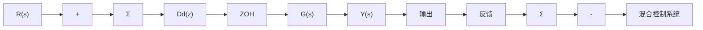
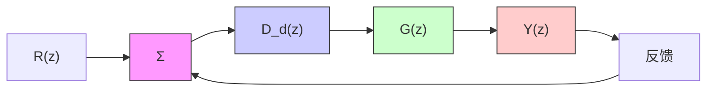

# 例8.4 离散根轨迹

对于图 8.17a 所示的案例， $G(s)$ 为

$$G (s) = \frac {a}{s + a}$$

flowchart

flowchart

图 8.17

且 $D_{\mathrm{d}}(z)=K$ ，绘制关于K的根轨迹并将结果与连续形式下系统的根轨迹进行比较。讨论所绘根轨迹的含义。

解答。由式(8.41)可得

$$
G (z) = (1 - z ^ {- 1}) \mathcal {L} \left\{\frac {a}{s (s + a)} \right\}
\begin{array}{l} = (1 - z ^ {- 1}) \left[ \frac {(1 - \mathrm{e} ^ {- a T}) z ^ {- 1}}{(1 - z ^ {- 1}) (1 - \mathrm{e} ^ {- a T} z ^ {- 1})} \right] \\ = \frac {1 - \alpha}{z - \alpha} \\ \end{array}
$$

其中：

$$\alpha = \mathrm{e} ^ {- a T}$$

为了分析闭环系统的性能，应用标准的根轨迹规则。图8.18a给出对应离散情况的结果，图8.18b给出对应连续情况的结果。在连续的情况中，系统对所有的K值均保持稳定，与离散的情况相反，随着z从0变到-1，阻尼比随之下降，系统产生振荡并最终变得不稳定。这种不稳定是由零阶保持器的滞后效应引起的，在离散分析中能够恰当的说明这一情况。

text_image

Im (z)
z=-1
z=α
z=0
Re (z)

a）z平面根轨迹

text_image

Im (s)
s=-α
Re (s)

b）s平面根轨迹   
图 8.18
