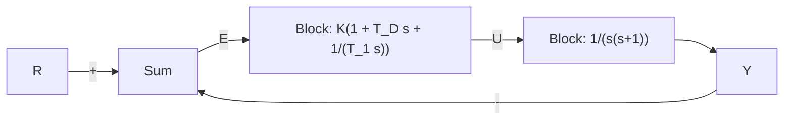

# 复习题

8.5 给出选用数字处理器代替模拟电路实现控制器的两个优势。

8.6 给出选用数字处理器代替模拟电路实现控制器的两个不利之处。

△8.7 若采样速率为 $5 \times \omega_{BW}$ ，试说明如何得到 $D_{\mathrm{d}}(z)$ ?

$$y (k) - 3 y (k - 1) + 2 y (k - 2)= 2 u (k - 1) - 2 u (k - 2)$$

其中：

$$
u (k) = \left\{ \begin{array}{l l} k, & k \geqslant 0 \\ 0, & k <   0 \end{array} \right.
y (k) = 0, \quad k < 0
$$

8.3 单边 $z$ 变换的定义为

$$F (z) = \sum_ {0} ^ {+ \infty} f (k) z ^ {- k}$$

(a) 证明： $f(k+1)$ 的单边 z 变换为 $\mathcal{X}\{f(k+1)\}=zf(z)-zf(0)$ 。

(b) 用单边 z 变换求解由差分方程 $u(k+2)=u(k+1)+u(k)$ 得到的斐波那契 (Fibonacci) 数列的变换式。令 $u(0)=u(1)=1$ [提示：需用 $f(k)$ 的变换求出 $f(k+2)$ 变换的一般表达式]。

(c) 求出斐波那契数列的变换的极点位置

(d) 求出斐波那契数列的反变换

(e) 如果用 $u(k)$ 表示第 k 个斐波那契数，试证明： $u(k+1)/u(k)$ 将接近 $(1+\sqrt{5})/2$ 。这就是希腊人高度评价的黄金比例。

8.4 证明 8.2.3 节 s 平面映射到 z 平面的七个特性。

8.3节习题

8.5 某单位反馈系统的开环传递函数为

$$G (s) = \frac {2 5 0}{s [ (\frac {s}{1 0}) + 1 ]}$$

将下面的滞后控制器与被控对象相串联得到 $50^{\circ}$ 的相位裕度：

$$D _ {c} (s) = \frac {s / 1 . 2 5 + 1}{5 0 s + 1}$$

用零极点匹配近似法求出该控制器的一个等效数字实现。

8.6 下面的传递函数为一个超前网络，其设计目的为在 $\omega_{1} = 3\mathrm{rad / s}$ 处增加约 $60^{\circ}$ 的相位：

$$H (s) = \frac {s + 1}{0 . 1 s + 1}$$

(a) 假设采样周期为 T=0.25s，用(1)图斯蒂法(2)零极点映射法求出 $H(s)$ 的数字实现，计算并绘制该实现的 z 平面的零极点位置。对每种情况分别计算出网络在 $z_{1}=e^{jw_{1}T}$ 处提供的超前相位值。

(b) 运用 lg-lg 坐标，针对 $\omega=0.1$ 到 $\omega=100rad/s$ 的频率范围，为(a)中求出每个等效数字系统绘制幅值伯德图并与 $H(s)$ 进行比较（提示：幅值伯德图由 $\left|H(z)\right|= \left|H\left(\mathrm{e}^{\mathrm{j}\omega T}\right)\right|$ 给出）。

8.7 为了在 $\omega_{1}=3rad/s$ 处引入一个大小为 10 (-20dB) 的增益衰减，设计一个滞后网络的传递函数为

$$H (s) = \frac {1 0 s + 1}{1 0 0 s + 1}$$

(a) 假设采样周期为 T=0.25s，用(1)图斯蒂法和(2)零极点映射法求出 $H(s)$ 的数字实现，计算并绘制该实现的 z 平面的零极点位置。对每种情况分别计算网络在 $z_{1}=e^{jw_{1}T}$ 处提供的增益衰减值。

(b) 对(a)中求出的每个等效数字系统绘制幅值伯德图曲线，频率范围取 $\omega=0.01$ 到 $\omega=10rad/s$ 。

8.5节习题

8.8 如图 8.22 所示系统，求出 K， $T_{D}$ 和 $T_{l}$ 的值，使得闭环极点满足 $\zeta > 0.5$ 且 $\omega_{n} > 1rad/s$ 。运用

flowchart

图 8.22 习题 8.8 的控制系统

(a) 图斯蒂法；

(b) 零极点匹配法。

离散化 PID 控制器。使用 Matlab 分别在 T=1, 0.1, 0.01s 的采样时刻对这些数字化实现进行仿真。

△ 8.6 节习题

8.9 有一系统结构如图 8.23 所示，其中：

$$G (s) = \frac {4 0 (s + 2)}{(s + 1 0) (s ^ {2} - 1 , 4)}$$

flowchart

