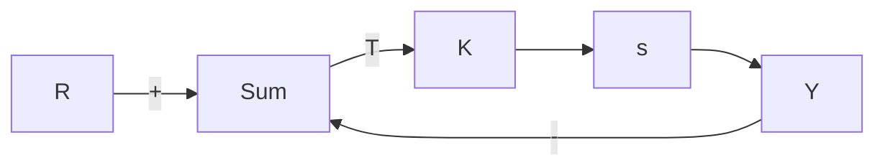

图 8.23 习题 8.9 的控制系统

(a) 假设系统串联了零阶保持器(ZOH)，求出 T=1 时的传递函数 $G(z)$ 。

(b) 用 Matlab 绘制该系统关于 K 的根轨迹。

(c) 求出使闭环系统稳定的 K 的取值范围。并与使用模拟控制器的情况比较（即采样开关总处于闭合状态的情况）。哪个系统 K 的允许值更大？

(d) 使用 Matlab 计算连续系统和离散系统的阶跃响应，为连续系统选取 K 使其阻尼比 $\zeta=0.5$ 。

8.10 单轴卫星姿态控制：卫星常常需要通过姿态控制来使天线和传感器相对于地球有正确的方位。图 8.24 所示的为一个通信卫星的三轴姿态控制系统。为了研究三轴问题，通常一次只考虑一个轴。图 8.24 描述了这种情况，图中的运动只允许围绕着一个垂直于纸面的轴进行。系统的运动方程为

$$\ddot {I \theta} = M _ {\mathrm{C}} + M _ {\mathrm{D}}$$

其中：I 为卫星相对于质心的转动惯量；

text_image

惯性参考轴
θ

图 8.24 习题 8.10 的卫星控制系统

$M_{C}$ 为助推器产生的控制力矩； $M_{D}$ 为扰动力矩； $\theta$ 为卫星轴相对于一个没有角加速度的惯性参考面的角度。

标准化运动方程定义为

$$u = \frac {M _ {\mathrm{C}}}{I}, \quad w _ {\mathrm{d}} = \frac {M _ {\mathrm{D}}}{I}$$

得：

$$\ddot {\theta} = u + w _ {d}$$

取拉普拉斯变换得

$$\theta (s) = \frac {1}{s ^ {2}} [ u (s) + w _ {\mathrm{d}} (s) ]$$

若不存在扰动，则有

$$\frac {\theta (s)}{u (s)} = \frac {1}{s ^ {2}} = G _ {1} (s)$$

在离散的情况下 u 作用于零阶保持器，我们可以用本章介绍的方法得到离散传递函数为

$$G _ {1} (z) = \frac {\theta (z)}{u (z)} = \frac {T ^ {2}}{2} [ \frac {z + 1}{(z - 1) ^ {2}} ]$$

(a) 假设采取比例控制，试手工绘制该系统的根轨迹。  
(b)运用 Matlab 绘制根轨迹并验证手工绘制的图形。  
(c) 给你的控制器添加一个离散速度反馈使得主导极点的 $\zeta=0.5,\omega_{n}=3\pi/(10T)$ 。  
(d) T=1s 时反馈增益是多少？T=2s 时又是多少？  
(e) 绘制 T=1s 时的闭环阶跃响应及对应的时域控制序列。

8.11 可以用电磁铁将一个磁性球体悬挂起来，电磁铁的电流通过该球体的位置来控制（由伍德森（Woodson）和梅尔泽（Melcher）于1968年提出）。其中一种可行的原理图如图8.25所示，斯坦福大学使用该工作系统的照片如图9.2所示。其运动方程为

$$m \ddot {x} = - m g + f (x, I)$$

其中： $f(x, I)$ 表示电磁铁施加在球上的力。当达到平衡点时，磁力与重力平衡。假设用 $I_{0}$ 表示平衡点的电流。若 $I = I_{0} + i$ ，将 f 在 x = 0 和 $I = I_{0}$ 处展开并忽略高阶项就可得到线性化方程为

$$m \ddot {x} = k _ {1} x + k _ {2} i \tag {8.54}$$

式(8.54)中常数的合理数值为 m=0.02kg， $k_{1}=20N/m,\quad k_{2}=0.4N/A$ 。

(a) 计算从 I 到 x 的传递函数，对于简单的反馈 i = -Kx 绘制（连续的）根轨迹。  
(b) 假设输入作用在零阶保持器(ZOH)上，令采样周期为 0.02s。试计算等效离散时间对象的传递函数。  
(c) 为磁悬浮设备设计一个数字控制系统，使闭环系统满足如下的性能指标： $t_{r} \leqslant$

natural_image

Diagram of a scientific experimental setup with a probe, lens, and solar panel (no text or labels)

图 8.25 习题 8.11 中磁铁悬浮设备的结构图 0.1s, $t_{r} \leqslant 0.1s$ 以及超调量 $\leqslant 20\%$ .
