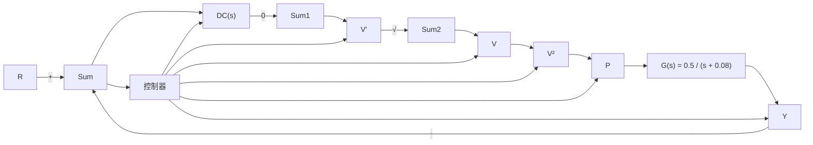

# 例 9.5 快速热处理系统的线性化

考虑如图 9.5 所示的使用非线性灯作为执行器的快速热处理系统。假设灯的输入是电压 V，输出是功率 P，它们的关系为

$$P = V ^ {2}$$

647

设计一个非线性逆将此系统线性化。

flowchart

图 9.5 通过逆非线性线性化

解答。我们只在灯的输入前串联一个平方根非线性，即

$$V = \sqrt {V ^ {\prime}}$$

整个开环级联系统现在对于任何电压值都是线性的：

$$Y = G (s) P = G (s) V ^ {2} = G (s) V ^ {\prime}$$

因此，我们可以用线性控制法设计动态补偿器 $D_{\mathrm{c}}(s)$ 。注意，为确保模块的输入始终保持非负值，需要将一个非线性元件串联到平方根元件前面。控制器的实现如图9.5所示。如果想了解该方法在控制设计上更加详细地的应用，我们推荐读者参见10.6节对于快速热处理系统的研究。
