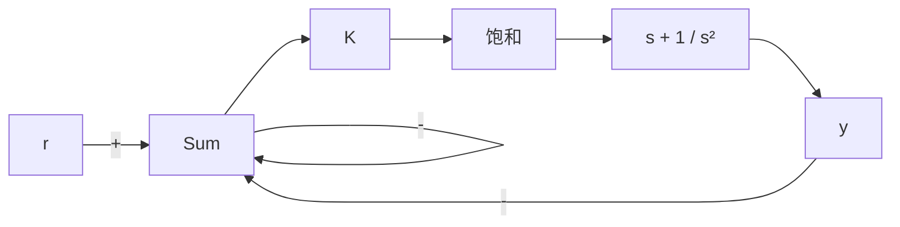

# 例9.6 变超调和饱和非线性

考虑图 9.7 所示的带有饱和特性的系统。用根轨迹法判断系统的稳定性。

flowchart

图 9.7 带有饱和的动态系统

解答。此系统不含饱和特性时关于 K 的根轨迹如图 9.8 所示。在 K=1 时，阻尼比为 $\zeta=0.5$ 。随着增益的减小，根轨迹显示根朝着 s 平面的原点移动，并且阻尼比越来越小。可以利用 Simulink 程序获得系统的阶跃响应。将一系列具有不同幅值的阶跃输入 r 作用于系统，得到如图 9.9 所示的结果。只要输入饱和环节的信号小于 0.4，系统就是线性的，系统的行为就是$\zeta=0.5$ 处的根所应该具有的行为特点。然而，可以看到，随着输入信号的变大，响应的超调也越来越大，恢复得也越来越慢。注意到输入信号越大相当于有效增益K越来越小，正如9.10中所见的那样，这就可以解释得通了。从图9.8所示的根轨迹图我们看到：随着增益K的减小，闭环极点更加接近原点，阻尼比越来越小。这导致了响应具有更长的上升时间和调节时间，更大的超调以及更强烈的振荡。

text_image

K=1
-1
Im(s)
Re(s)

图9.8 $(s + 1)^2 / s^2$ 的根轨迹，图9.7中不含饱和特性的系统

line

| 时间/s | r=2 | 4 | 6 | 8 | 10 | 12 |
| --- | --- | --- | --- | --- | --- | --- |
| 0 | 0 | 0 | 0 | 0 | 0 | 0 |
| 5 | 2 | 4 | 6 | 8 | 10 | 12 |
| 10 | 3 | 5 | 8 | 10 | 12 | 14 |
| 15 | 3 | 4 | 6 | 8 | 10 | 12 |
| 20 | 3 | 4 | 6 | 8 | 10 | 10 |
| 25 | 3 | 4 | 6 | 8 | 10 | 10 |
| 30 | 3 | 4 | 6 | 8 | 10 | 10 |

图 9.9 对于各种输入的阶跃值图 9.7 系统的阶跃响应

line

| 输入幅值 | 增益 |
| --- | --- |
| a | N/a |

图 9.10 饱和有效增益的通用图
