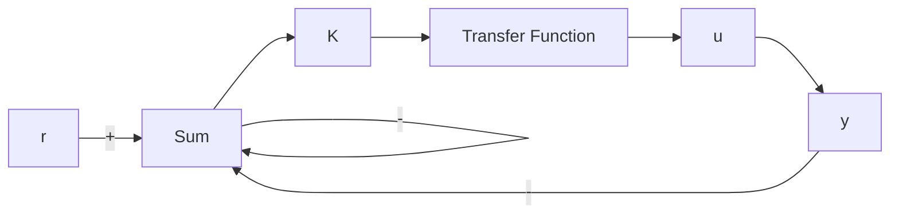

# 例9.7 用根轨迹分析条件稳定系统的稳定性

考虑用信号依赖的增益来描述非线性响应的另一个例子，如图 9.11 所示的带有饱和非线性的系统。判断系统是否稳定。

解答。去掉饱和特性后，系统的根轨迹如图9.12所示。从这个根轨迹上，我们能够容易地计算出穿过虚轴的点发生在 $\omega_0 = 1$ ， $K = \frac{1}{2}$ 时。这种对于较大增益稳定，而对较小增益却不稳定的系统称为条件稳定系统。

flowchart

图 9.11 附加条件的稳定系统框图

如果 K=2 时，对应于 $\zeta=0.5$ 时的根轨迹，系统对小的参考输入信号应该符合 $\zeta=0.5$ 的响应。然而，随着参考输入的变大，等价增益会由于饱和而变小，系统的阻尼特性将会变差。最终，对于某一足够大的输入信号，系统将会变得不稳定。图 9.13 所示的为 K=2 时系统的非线性仿真得到的阶跃响应，阶跃的幅值分别取为 r=1.0, 2.0, 3.0 和 3.4。这些响应证实了我们的推测。另外，临界稳定的情况表明以接近 1rad/s 的角频率振荡，正如预测的一样，这恰是根轨迹进入右半平面的临界点处的角频率。

scatter

| 实轴 | 虚轴 |
| --- | --- |
| -1.0 | 0.0 |
| -0.5 | 0.5 |
| 0.0 | 1.0 |
| 0.5 | 0.5 |
| -1.0 | -1.0 |
| -0.5 | -0.5 |
| 0.0 | 0.0 |

图9.12 图9.11的系统 $G(s) = (s + 1)^2 / s^3$ 的根轨迹

line

| 时间/s | 幅值 (r=3.475) |
| --- | --- |
| 0 | 0 |
| 2 | ~3 |
| 4 | ~6 |
| 6 | ~1 |
| 8 | ~3 |
| 10 | ~7 |
| 12 | ~3 |
| 14 | ~0 |
| 16 | ~8 |
| 18 | ~9 |
| 20 | ~1 |

图 9.13 图 9.11 系统的阶跃响应
