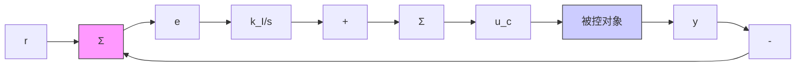
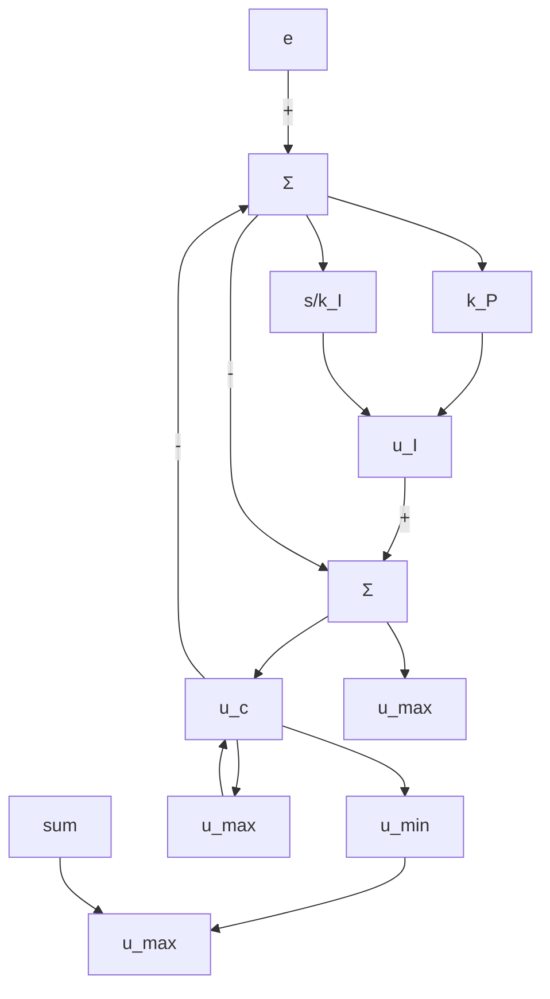

# 积分器抗饱和

在任何控制系统中，执行器的输出都会饱和，因为实际执行器的动态范围是有限的。比如，一个阀在它完全打开或关闭时会饱和，飞行器上的操纵面与它们标准位置的偏移量不能超过某些角度，电子放大器只会产生有限的电压输出，等等。一旦执行器发生饱和，被控过程的控制信号就会停止变化，反馈路径便被有效地断开了。如果在这些条件下，误差信号继续施加到积分器的输入上，积分器输出将一直增长（饱和）直到误差的符号改变、积分反向。这样的后果会导致非常大的超调，因为需要有足够大的输出，产生反向的误差积累才能使积分

line

| 时间/s | 幅值 (r=2) | 幅值 (r=4) |
| --- | --- | --- |
| 0 | 0 | 0 |
| 5 | 0.5 | 0.5 |
| 10 | 1.0 | 1.0 |
| 15 | 1.5 | 1.5 |
| 20 | 2.0 | 2.0 |
| 25 | 2.0 | 2.5 |
| 30 | 2.0 | 3.0 |
| 35 | 2.0 | 3.5 |
| 40 | 2.0 | 4.0 |
| 45 | 2.0 | 4.0 |
| 50 | 2.0 | 4.0 |

图 9.19 图 9.18 中系统的阶跃响应

器退出饱和，结果动态响应品质极差。实际上，积分器是开环中的一种不稳定因素，当饱和发生时，必须镇定积分器。

考虑图9.20所示的反馈系统。假设一个给定的参考阶跃信号，其幅度大于使执行器发生饱和的 $u_{\mathrm{max}}$ 。积分器会一直对误差 $e$ 积分，信号 $u_{\mathrm{c}}$ 会持续增长。然而，被控对象的输入停留在其最大值，也就是 $u = u_{\mathrm{max}}$ ，因此误差将一直很大，直到对象输出超过参考值且误差变号为止。既然被控对象的输入不改变，所以 $u_{\mathrm{c}}$ 的增长无任何意义，但如果饱和持续的时间很长， $u_{\mathrm{c}}$ 会变得非常大。因此需要相当大的负向误差，也就是在很恶劣的动态响应下才能使积分器的输出重新回到线性非饱和区域。

flowchart

图 9.20 带有执行器饱和的反馈系统

解决这一问题的方法是采用积分器抗饱和回路，当执行器饱和的时候，它会“关闭”积分行为（如果控制器通过数字实现，这很容易借助于形如“if $|u| = u_{\mathrm{max}}$ ， $k_{1} = 0$ ”的逻辑表述来实现，见第8章）。图9.21(a，b)给出了针对PI控制器的两个等价的抗饱和方案。图9.21a所示方法比较容易理解，而图9.21b所示方法更易于实现，因为它不需要额外增加单独的非线性部分，而是利用饱和环节本身的特性。 $^{①}$ 在这些方案中，一旦执行器饱和，就会激活积分器周围的反馈环，以保持从 $e_{1}$ 点进入积分器的输入较小。在此期间，积分器实质上变为快速一阶滞后环节。值得注意的是：为了说明这一点，我们可以将图9.21a所示框图中从e到 $u_{c}$ 的部分重画，如图9.21c所示。积分部分变为图9.21d所示的一阶滞后环节。抗饱和增益 $K_{a}$ 应该足够大，以保证抗饱和电路在所有误差条件下，都能使积分器的输入值较小。

flowchart

a)
