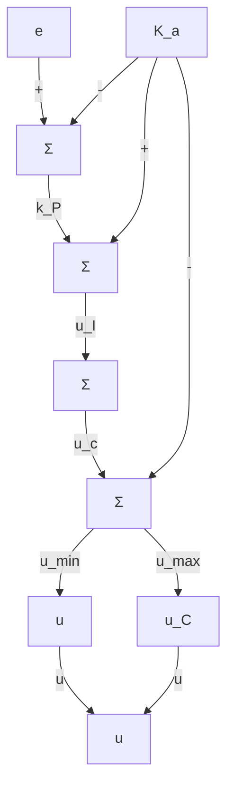

flowchart

b)

flowchart

c)

  
d)   
图 9.21 积分器抗饱和技术

抗饱和的作用是减小反馈系统中的超调和控制作用。在任何积分控制的实际应用中都有必要实施这样的抗饱和方案，忽略这种技术将会导致响应的严重恶化。从稳定性的角度看，饱和的影响就是断开反馈环使得开环对象输入为常值，控制器成为一个以系统误差为输入的开环系统。

抗饱和的目的是：当主回路由于信号饱和而断开时，为控制器提供局部反馈使得其自身稳定，任何这样的回路都会起到抗饱和的作用。
