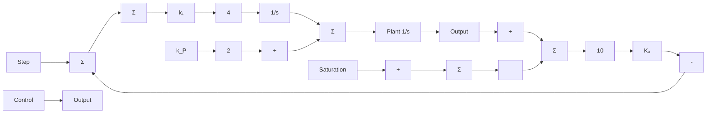

# 例9.9 PI控制器的抗饱和补偿

小信号下，考虑具有如下传递函数的被控对象：

$$G (s) = \frac {1}{s}$$

以及 PI 控制器

$$D _ {\mathrm{c}} (s) = k _ {\mathrm{P}} + \frac {k _ {\mathrm{I}}}{s} = 2 + \frac {4}{s}$$

以单位反馈结构连接。被控对象的输入被限制在 $\pm1.0$ 。研究抗饱和对系统响应的影响。

解答。假定我们使用反馈增益值为 $K_{a}=10$ 的抗饱和回路，如仿真框图 9.22 所示。图 9.23a 给出了系统具有和不具有抗饱和环节时的阶跃响应。图 9.23b 给出了对应的控制作用。可看到具有抗饱和环节的系统确实有更小的超调和更小的控制作用。

flowchart

图9.22 抗饱和例子的仿真图

line

| 时间/s | 输出 (不具有抗饱和) | 输出 (具有抗饱和) |
| --- | --- | --- |
| 0 | 0.0 | 0.0 |
| 1 | 0.8 | 0.9 |
| 2 | 1.5 | 1.15 |
| 3 | 1.0 | 1.0 |
| 4 | 1.0 | 1.0 |
| 5 | 1.0 | 1.0 |
| 6 | 1.0 | 1.0 |
| 7 | 1.0 | 1.0 |
| 8 | 1.0 | 1.0 |
| 9 | 1.0 | 1.0 |
| 10 | 1.0 | 1.0 |

a）阶跃响应

line

| 时间/s | 不具有抗饱和 | 具有抗饱和 |
| --- | --- | --- |
| 0 | 1.0 | 1.0 |
| 1 | 0.8 | 0.8 |
| 2 | 0.4 | 0.4 |
| 3 | -0.2 | -0.6 |
| 4 | 0.0 | 0.0 |
| 5 | 0.0 | 0.0 |
| 6 | 0.0 | 0.0 |
| 7 | 0.0 | 0.0 |
| 8 | 0.0 | 0.0 |
| 9 | 0.0 | 0.0 |
| 10 | 0.0 | 0.0 |

b）控制作用  
图 9.23 积分抗饱和
