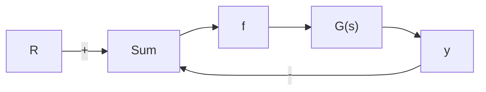

# 利用描述函数法进行稳定性分析

非线性系统中的非线性环节用描述函数近似后，可以用推广的奈奎斯特定理来处理。在标准的线性系统分析中，特征方程是 $1 + KL = 0$ ，其中， $L = D_{\mathrm{c}}G$ 为回路增益并且

$$L = - \frac {1}{K} \tag {9.35}$$

如同 6.3 节所述，我们根据奈奎斯特曲线环绕 -1/K 点的圈数来判断稳定性。当用描述函数 $K_{\mathrm{eq}}(\alpha)$ 表示非线性时，特征方程为 $1 + K_{\mathrm{eq}}(a)L = 0$ ，因此有

$$L = - \frac {1}{K _ {\mathrm{eq}} (a)} \tag {9.36}$$

现在，我们必须查看 $L$ 与 $-1 / K_{\mathrm{eq}}(a)$ 的交点，如果曲线 $L$ 与 $-1 / K_{\mathrm{eq}}(a)$ 相交，根据描述函数所得近似性质可知，系统将会在穿越幅值 $a_1$ 的交点处产生振荡，且相应的频率为 $\omega_{1}$ 。然后，就像对线性系统那样，我们查看圈数来判断对某个特定的增益值系统是否稳定。如果是这样，我们推断非线性系统是稳定的。否则，断定非线性系统是不稳定的。

图 9.31 所示的例子中，除了一个非线性环节外，其余都是线性环节。非线性环节其实有可能起到抑制振荡的有利作用。可用描述函数法来确定极限环的幅值和频率。严格地说，一个极限环系统可认为是不稳定的。事实上，极限环的轨迹被限制在状态空间的一个有限区域内。如果这个区域在性能

flowchart

图 9.31 具有非线性的闭环系统

允许的范围之内，那么这种响应也是可以接受的。在一些情况下，极限环也有积极作用（参见10.4节研究的情况）。由于系统不会静止在状态空间的原点，所以系统也就不具有渐近稳定性。描述函数法对确定不稳定的产生条件很有帮助，甚至能提出消除不稳定性的补救措施，这点将在接下来的例子中说明，例子中把线性回路增益的奈奎斯特曲线 $L$ 和描述函数的负倒数 $-1 / K_{\mathrm{eq}}(a)$ 画在一起。它们相交的点就代表极限环。为了确定极限环的幅值和频率，我们将式(9.36)重写为

$$\operatorname{Re} \{L (\mathrm{j} \omega) \} \operatorname{Re} \left\{K _ {\mathrm{eq}} (a) \right\} - \operatorname{Im} \{L (\mathrm{j} \omega) \} \operatorname{Im} \left\{K _ {\mathrm{eq}} (a) \right\} + 1 = 0 \tag {9.37}\operatorname{Re} \{L (\mathrm{j} \omega) \} \operatorname{Im} \left\{K _ {\mathrm{eq}} (a) \right\} + \operatorname{Im} \{L (\mathrm{j} \omega) \} \operatorname{Re} \left\{K _ {\mathrm{eq}} (a) \right\} = 0$$

然后，我们求解这两个方程，能得到两个未知量，极限环的频率 $\omega_{1}$ 及其相应幅值 $a_{1}$ 的可能值，接下来举例说明。
