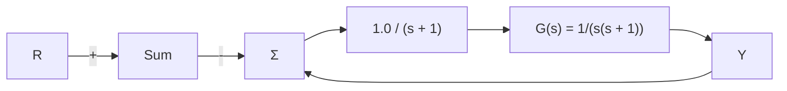

# 例9.14 确定带有滞环非线性特性的稳定性

考虑图 9.34 所示的带有滞环非线性特性的系统。判断该系统是否稳定，并求出极限环的幅值和频率。

flowchart

图 9.34 含有滞环非线性的反馈系统

解答。图 9.35 给出了系统的奈奎斯特图。滞环非线性描述函数的负倒数为

$$- \frac {1}{K _ {\mathrm{eq}} (a)} = - \frac {1}{\frac {4 N}{\pi a} \left(\sqrt {1 - \left(\frac {h}{a}\right) ^ {2}} - \mathrm{j} \frac {h}{a}\right)} = - \frac {\pi}{4 N} [ \sqrt {a ^ {2} - h ^ {2}} + \mathrm{j} h ]$$

line

| Parameter | Value |
| --- | --- |
| ω | 2.2 |
| a | 0.24 |
| α | -0.1714 |
| a=h | 0.1 |
| Σe | -1/(Keq(a)) |

图 9.35 用奈奎斯特图和描述函数来确定极限环的性质

在 $N = 1$ 和 $h = 0.1$ 的情况下，我们有

$$- \frac {1}{K _ {\mathrm{eq}} (a)} = - \frac {\pi}{4} [ \sqrt {a ^ {2} - 0 . 0 1} + 0. 1 \mathrm{j} ]$$

这是一条平行于实轴的直线，是以输入信号幅值 a 为参数的函数，如图 9.35 所示。该曲线和奈奎斯特图的交点显示了稳定极限环的频率和相应的幅值。我们也能以解析的方式确定极限环的信息为

$$- \frac {1}{K _ {\mathrm{eq}} (a)} = - \frac {\pi}{4} [ \sqrt {a ^ {2} - 0 . 0 1} + 0. 1 \mathrm{j} ] = G (\mathrm{j} \omega) = \frac {1}{\mathrm{j} \omega (\mathrm{j} \omega + 1)}$$

去掉前式的分母，我们得到

$$\frac {\pi}{4} \sqrt {a ^ {2} - 0 . 0 1} \omega^ {2} + \frac {0 . 1 \pi}{4} \omega - 1 + j \left[ \frac {0 . 1 \pi}{4} \omega^ {2} - \frac {\pi}{4} \sqrt {a ^ {2} - 0 . 0 1} \omega \right] = 0$$

分别令实部和虚部为零可以得到两个方程，含有两个未知数。相关的解为 $\omega_{1}=2.2rad/s$ 和 $a_{1}=0.24$ 。图 9.36 给出了闭环系统的仿真实现。系统的阶跃响应如图 9.37 所示，极限环的幅值为 $a_{1}=0.24$ ，频率为 $\omega_{1}=2.2rad/s$ ，我们的分析很好地预测了这个极限环。

flowchart

图 9.36 具有滞环特性系统的仿真图

line

| 时间/s | 输出, y |
| --- | --- |
| 0 | -0.2 |
| 5 | 1.4 |
| 10 | 0.8 |
| 15 | 1.2 |
| 20 | 0.8 |
| 25 | 1.2 |
| 30 | 0.8 |
| 35 | 1.2 |
| 40 | 0.8 |
| 45 | 1.2 |
| 50 | 0.8 |

图 9.37 显示极限环振荡的阶跃响应

669
