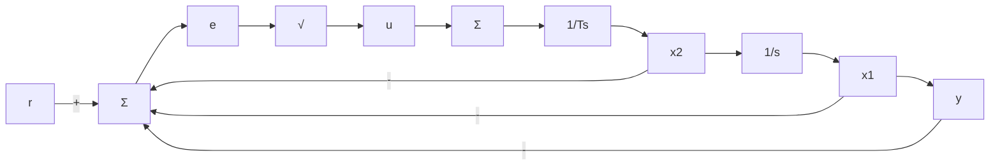

# 9.5.1 相平面法

根轨迹和频率响应的方法，通过传递函数的极点和零点的分布或频率响应的增益和相位间接地考虑系统的响应，而相平面法则通过绘出状态变量的轨线直接考虑时间响应。尽管直接观测的方式使这种方法局限于只有两个状态变量的二阶系统，但这种方法能够适用于非线性研究，并为线性系统的研究提供新视角，因此该技术值得一看。

为说明相平面的思想，考虑如图9.38所示的构造的电机系统，其闭环传递函数为

$$G (s) = \frac {1}{s (T s + 1)}$$

如果我们假定 $T = 1 / 6$ ，该放大器（暂时）没有出现饱和且增益系数为 $K$ 其中 $K = 5T$ ，那么闭环系统的状态方程可写为：

flowchart

图9.38 一个具有非线性执行器的基本位置反馈系统

$$\dot {x} _ {1} = x _ {2} \tag {9.38}\dot {x} _ {2} = - 5 x _ {1} - 6 x _ {2} \tag {9.39}y = x _ {1} \tag {9.40}$$

由于这些等式是时不变的，用式(9.38)除式(9.39)可以消除时间变量并得到

$$\frac {\mathrm{d} x _ {2}}{\mathrm{d} x _ {1}} = \frac {- 5 x _ {1} - 6 x _ {2}}{x _ {2}} \tag {9.41}$$

这个等式的解给出了 $x_{2}$ 关于 $x_{1}$ 的图形，或者换句话说，给出了以 $(x_{1}, x_{2})^{\ominus}$ 为坐标的轨迹。在绘出式(9.41)的轨迹之前，先考虑以矩阵形式给出的系统方程 $\dot{x} = Ax$ 是很有用的，其中：

$$
\mathbf {A} = \left[ \begin{array}{c c} 0 & 1 \\ - 5 & - 6 \end{array} \right]
$$

如果我们在此等式中假设， $x=x_{0}e^{\alpha}$ ，其中：s 和 $x_{0}$ 均为常数，那么 $\dot{x}=x_{0}s e^{\alpha}$ ，此等式推导过程如下：

$$\dot {x} = A x \tag {9.42}\boldsymbol {x} _ {0} s \mathrm{e} ^ {s t} = \boldsymbol {A} \boldsymbol {x} _ {0} \mathrm{e} ^ {s t} \tag {9.43}[ s \boldsymbol {I} - \boldsymbol {A} ] \boldsymbol {x} _ {0} \mathrm{e} ^ {s t} = 0 \tag {9.44}[ s \boldsymbol {I} - \boldsymbol {A} ] \boldsymbol {x} _ {0} = 0 \tag {9.45}$$

在此需要说明的是，式(9.45)是矩阵 $\mathbf{A}$ 的特征方程，具体形式为

$$
\left[ \begin{array}{l l} s & - 1 \\ 5 & s + 6 \end{array} \right] \left[ \begin{array}{l} x _ {0 1} \\ x _ {0 2} \end{array} \right] = \left[ \begin{array}{l} 0 \\ 0 \end{array} \right] \tag {9.46}
$$

如附录 WE(www.fpe7e.com) 所述，式(9.46)仅在系数矩阵的行列式为 0 时才有解，即

$$s (s + 6) + 5 = 0 \tag {9.47}(s + 1) (s + 5) = 0 \tag {9.48}$$

故式(9.46)有解时的两特征值为 $s = -1$ 和 $s = -5$ 。如果把 $s = -1$ 代入式(9.46)，我们得到

$$
\left[ \begin{array}{c c} - 1 & - 1 \\ 5 & - 1 + 6 \end{array} \right] \left[ \begin{array}{l} x _ {0 1} \\ x _ {0 2} \end{array} \right] = \left[ \begin{array}{l} 0 \\ 0 \end{array} \right] \tag {9.49}
$$

此时，初始状态矢量的解为 $x_{02} = -x_{01}$ 。在状态空间里，这条直线就是对应特征值 $s = -1$ 的特征矢量。如果令 $s = -5$ ，重复这一过程，结果是
