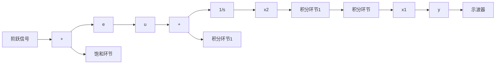

对于曲线上方的任意初始状态，我们应用 u = -1；对于曲线下方的任意初始状态，我们应用 $u = +1$ 。如上所述，这个结果将是最小时间响应。注意，曲线在原点处垂直于轴；这就使得，在原点邻域里的操作会引起异常敏感的反应。沃尔克曼（Workman，1987）研究了一种改良的版本，称作近似时间最优系统，常被用在计算机磁盘驱动器行业。其中改良的地方包括使曲线稍许移动，把原来原点处无限大斜率替换为线性区域里的有限斜率。这一结果已被广泛地用于硬盘驱动器和类似的系统中，而且有时也称为“滑动模态”控制。

由 Simulink 得到的对一个时间最优的系统和一个近似时间最优系统的几种典型响应如图 9.44 到图 9.46 所示。注意，两个系统的响应时刻几乎完全一致，但是时间最优控制系统在切换曲线具有无穷大斜率的地方产生了剧烈的震颤，而近似时间最优系统的输出响应平稳地滑动到其终值。对于更精确的研究，我们需要转向研究非线性方程。

bar

| 时间/s | u |
| --- | --- |
| 4 | 1.0 |

line

| 时间/s | y |
| --- | --- |
| 0 | 0 |
| 1 | 1 |
| 2 | 2 |
| 3 | 3 |
| 4 | 4 |
| 5 | 4 |

图 9.44 时间最优系统的响应

line

| 时间/s | u |
| --- | --- |
| 0 | 1.0 |
| 2 | -1.0 |
| 4 | 0.0 |

line

| 时间/s | 输出响应 (dB) |
| --- | --- |
| 0 | 0 |
| 1 | 1 |
| 2 | 2 |
| 3 | 3 |
| 4 | 4 |
| 5 | 4 |

图 9.45 近似时间最优系统的响应

flowchart

图 9.46 位置反馈系统的 Simulink 框图

676
