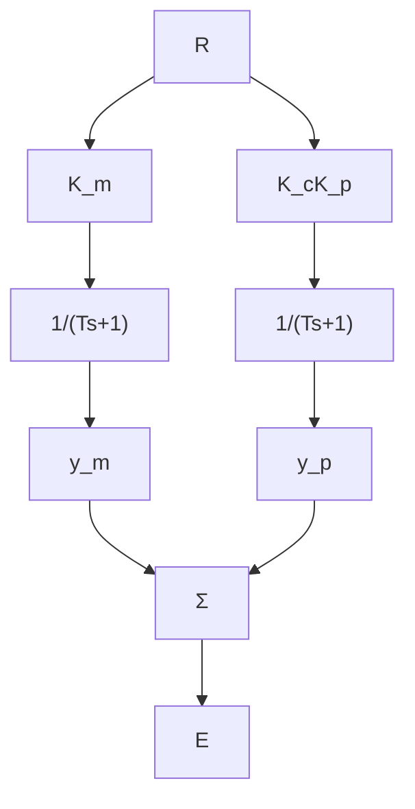

# 自适应控制的李雅普诺夫再设计

李雅普诺夫稳定性理论在控制领域的经典应用之一就是著名的李雅普诺夫再设计技术。其思想是构造一个带有一些待定的关键控制参数的系统，提出备选李雅普诺夫函数，然后选择可选的部分使得备选函数成为真正的李雅普诺夫函数，由此得出稳定性结论。此方法在一篇帕克斯(Parks)(1966年)早期的论文中被应用在一个模型参考自适应

系统中。首先考虑一个简单系统其框图如图 9.48 所示。

在这个系统中，模型和被控对象具有相同的动态，但有不同的增益。控制目标是调整控制增益 $K_{\mathrm{c}}$ ，使得 $K_{\mathrm{c}}K_{\mathrm{p}} = K_{\mathrm{m}}$ ，并且系统输出 $y_{\mathrm{p}}$ 将等于模型输出 $y_{\mathrm{m}}$ 。一种具有启发性的称之为MIT的规则正是基于如下思想提出的，如果我们定义成本为瞬时误差的平方，修改 $K_{\mathrm{c}}$ 使得成本更小，这样就会得到 $K_{\mathrm{c}}$ 的合适的值。如果耗能的梯度为正（也就是说成本上升），增益应当减小；而如果梯度为负，增益应当增加。因而，增益的时间导数应该正比于梯度的相反数。方程形式为

flowchart

图9.48 一个简单的模型参考自适应控制系统框图

$$J = \mathrm{e} ^ {2} \tag {9.72}\frac {\partial J}{\partial K _ {\mathrm{c}}} = 2 e \frac {\partial e}{\partial K _ {\mathrm{c}}} \tag {9.73}\frac {\mathrm{d} K _ {\mathrm{c}}}{\mathrm{d} t} = - B e \frac {\partial e}{\partial K _ {\mathrm{c}}} \tag {9.74}$$

其中 B 为待选 “自适应增益”。从系统框图得到：

$$E (s) = \frac {K _ {\mathrm{c}} K _ {\mathrm{p}} - K _ {\mathrm{m}}}{T s + 1} R (s) \tag {9.75}\frac {\partial E}{\partial K _ {c}} = \frac {K _ {p}}{T s + 1} R \tag {9.76}= \frac {K _ {\mathrm{p}}}{K _ {\mathrm{m}}} Y _ {\mathrm{m}} \tag {9.77}$$

如果我们把式(9.77)的结果代入式(9.74)，就得到了MIT规则：

$$\frac {\mathrm{d} K _ {\mathrm{c}}}{\mathrm{d} t} = - B ^ {\prime} e Y _ {\mathrm{m}} \tag {9.78}$$

其中： $B'$ 为新的适应增益。不幸的是，这条规则的稳定性没有建立，并且一些分析表明，在合理的情况下，它可能是不稳定的，例如，如果有未建模动态或扰动。帕克斯提出李雅普诺夫再设计会是一种很好的办法。他还提出， $K_{c}$ 的选择方式应该保证稳定性，而不是由式(9.74)给出。他的想法起始于下面的微分方程：

$$T \dot {e} + e = (K _ {\mathrm{c}} K _ {\mathrm{p}} - K _ {\mathrm{m}}) r _ {\mathrm{o}} \tag {9.79}\dot {K} _ {\mathrm{c}} = - B ^ {\prime} e Y _ {\mathrm{m}} \tag {9.80}$$

其中： $r=r_{0}$ 是一个常值。

为简化这些方程，定义 $x = (K_{\mathrm{c}}K_{\mathrm{p}} - K_{\mathrm{m}})$ ，而且 $\dot{x}$ 将被得出。帕克斯选择 $V = e^{2} + \lambda x^{2}$ 作为备选李雅普诺夫函数且计算

$$\dot {V} = 2 e \dot {e} + 2 \lambda x \dot {x} \tag {9.81}= 2 e \left(\frac {x r _ {\circ}}{T} - \frac {e}{T}\right) + 2 \lambda x \dot {x} \tag {9.82}$$

如果在最后的方程中 $\dot{x}$ 被选为 $\dot{x} = -\frac{er_0}{\lambda T}$ ，那么 $\dot{V} = -2\frac{e^2}{T}$ ，李雅普诺夫函数的条件都满足，给定的假设也就保证了系统的稳定性。反向推回去，我们发现新的算法为
