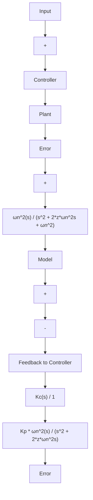

$$\dot {K} _ {\mathrm{c}} = - B ^ {\prime \prime} e r _ {\circ} \tag {9.83}$$

显然，这一结果并不能解答未建模动态和干扰的问题，但其原理是明确的：将关键控制方程作为待定方程，以便获得李雅普诺夫函数，这样系统的稳定性具有坚实的基础。

作为李雅普诺夫再设计的第二个例子，考虑图9.49所示电机的自适应控制。定义模型输出为 $y_{\mathrm{m}}$ ，系统输出为 $y_{\mathrm{p}}$ ，方程为

$$\ddot {y} _ {\mathrm{m}} + 2 \zeta \omega_ {\mathrm{n}} \dot {y} _ {\mathrm{m}} + \omega_ {\mathrm{n}} ^ {2} y _ {\mathrm{m}} = \omega_ {\mathrm{n}} ^ {2} r \tag {9.84}\ddot {y} _ {\mathrm{p}} + 2 \zeta \omega_ {\mathrm{n}} \dot {y} _ {\mathrm{p}} + \omega^ {2} y _ {\mathrm{p}} = K _ {\mathrm{c}} K _ {\mathrm{p}} \omega_ {\mathrm{n}} ^ {2} (r - y _ {\mathrm{p}}) + \omega_ {\mathrm{n}} ^ {2} y _ {\mathrm{p}} \tag {9.85}$$

flowchart

图 9.49 电机自适应控制框图

（在这个关于 $y_{p}$ 的方程中，两端同时加上了 $\omega_{n}^{2}y_{p}$ 项，这样使得误差方程更加简单。）

定义误差为 $e=y_{m}-y_{p}$ ，误差方程可通过 $y_{m}$ 的方程减去 $y_{p}$ 的方程得到，结果为

$$\ddot {e} + 2 \zeta \omega_ {\mathrm{n}} \dot {e} + \omega_ {\mathrm{n}} ^ {2} y e = \omega_ {\mathrm{n}} ^ {2} \left(1 - K _ {\mathrm{c}} K _ {\mathrm{p}}\right) (r - y _ {\mathrm{p}}) \tag {9.86}$$

现在的想法是找到 $K_{c}$ 的方程，以便为误差方程找到李雅普诺夫函数。为简化计算，我们定义参数为 $x=1-K_{c}K_{p}$ ，则 $\dot{x}=-K_{p}\dot{K}_{c}$ ，根据该式，误差方程变为

$$\ddot {e} _ {\mathrm{p}} + 2 \zeta \omega_ {\mathrm{n}} \dot {e} + \omega_ {\mathrm{n}} ^ {2} e = \omega_ {\mathrm{n}} ^ {2} x (r - y _ {\mathrm{p}}) \tag {9.87}$$

在此提出 $V=e^{2}+a\dot{e}^{2}+\beta x^{2}$ 作为可能的函数。我们需要求 $\dot{x}$ ，使得 V 成为李雅普诺夫函数。微分方程为

$$V = 2 e \dot {e} + 2 \alpha \dot {e} \ddot {e} + 2 \beta x \dot {x} \tag {9.88}= 2 e \dot {e} + 2 \alpha \dot {e} \left\{- 2 \zeta \omega_ {\mathrm{n}} \dot {e} - \omega_ {\mathrm{n}} ^ {2} e + \omega_ {\mathrm{n}} ^ {2} x \left(r - y _ {\mathrm{p}}\right) \right\} + 2 \beta x \dot {x} \tag {9.89}= - 4 \alpha \zeta \omega_ {n} \dot {e} ^ {2} + 2 e \dot {e} (1 - \alpha \omega_ {n} ^ {2}) + x \left\{2 \alpha \dot {e} \omega_ {n} ^ {2} (r - y _ {p}) + 2 \beta \dot {x} \right\} \tag {9.90}$$

如果令 $1-\alpha\omega_{n}^{2}=0$ ，且 $2\alpha\dot{e}\omega_{n}^{2}(r-y_{p})+2\beta\dot{x}=0$ ，那么 V 的方程简化为 $V=-4\alpha\zeta\omega_{n}\dot{e}^{2}$ ，这样 V 总是负定的，于是 V 是李雅普诺夫函数，从而系统是稳定的。替换 x，我们得到自适应控制律

$$K _ {\mathrm{c}} = - \beta^ {\prime} \dot {e} (r - y _ {\mathrm{p}}) \tag {9.91}$$

其中： $\beta'$ 是等于 $\frac{\alpha\omega_{n}^{2}}{K_{p}\beta}$ 的新常数。

显然，我们仅涉及了李雅普诺夫稳定性理论，尽管再设计的例子很古老，甚至可以追溯到1966年，但是它们很好地说明了这一原理，并为进一步研究这一重要领域提供了良好开端。
