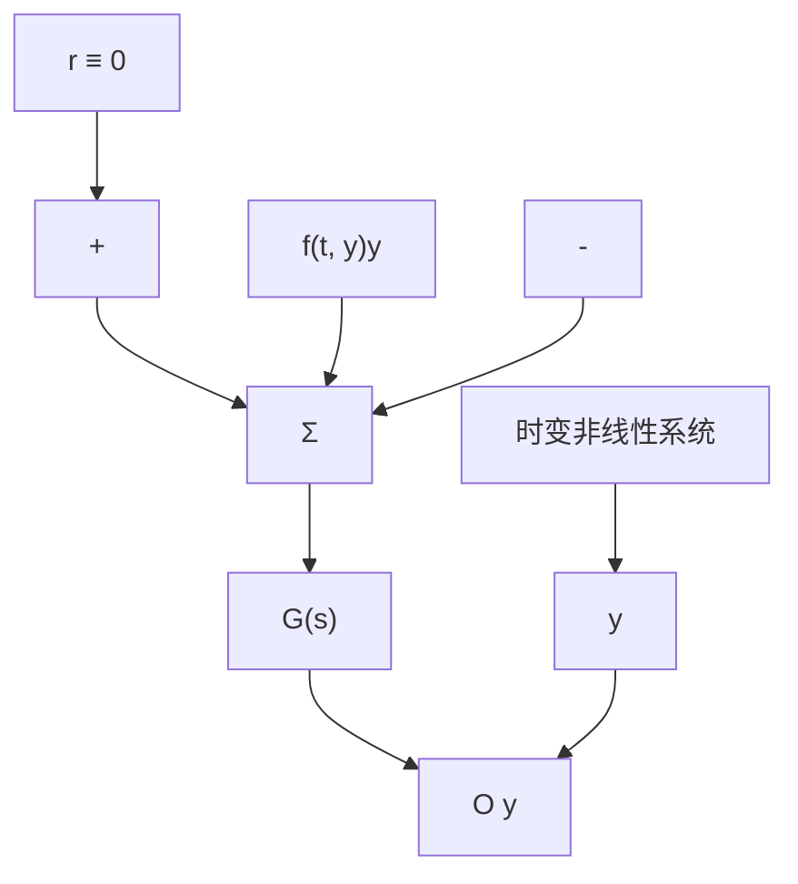

# 例 9.18 饱和非线性扇形区

考虑如图 9.52 所示的饱和非线性函数，确定此函数的扇形区。

解答。此函数上方由一条斜率为1的直线界定，所以 $k_{2}=1$ ；且由x轴界定下方，则 $k_{1}=0$ ，如图所示。因此，函数的扇形区为 $[0,1]$ 。

flowchart

图 9.50 非线性系统框图

text_image

f(t,y)y
斜率为k₂
斜率为k₁
O
y

图9.51 限制在一定扇形区的非线性的输出

line

| 输入 | 输出 |
| --- | --- |
| 0 | 0 |
| 0.1 | 0.1 |

图 9.52 饱和扇形区
