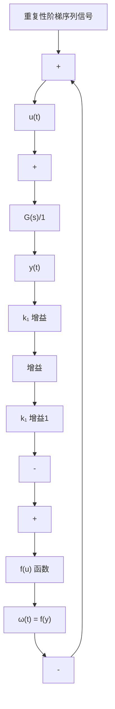

$$\delta \| u \| ^ {2} + \frac {\| u (t) \| ^ {2}}{K} > 0 \tag {9.104}\left[ \operatorname{Re} \{G (\mathrm{j} \omega) \} + \frac {1}{K} \right] \| u (t) \| ^ {2} > 0 \tag {9.105}\operatorname{Re} \left\{K G (\mathrm{j} \omega) + 1 \right\} > 0 \tag {9.106}$$

在推导式(9.106)时，假设非线性项位于一个零扇形区域[0，K]。如果函数实际位于扇形区 $[k_1, k_2]$ ，可通过在框图中加或减 $k_1$ ，使之移动到零扇形区域，框图如图9.53所示。则相应地，动态系统由 $H = \frac{G}{1 + k_1G}$ 替代，函数由 $f' = f - k_1$ 替代，其中： $f'$ 位于 $[k_2 - k_1, 0]$ 。在这些改变之下，稳定性判据变为

$$\operatorname{Re} \left\{1 + \left(k _ {2} - k _ {1}\right) \frac {G}{1 + k _ {1} G} \right\} > 0 \tag {9.107}\operatorname{Re} \left\{\frac {1 + k _ {1} G + (k _ {2} - k _ {1}) G}{1 + k _ {1} G} \right\} > 0 \tag {9.108}\operatorname{Re} \left\{\frac {1 + k _ {2} G (\mathrm{j} \omega)}{1 + k _ {1} G (\mathrm{j} \omega)} \right\} > 0 \tag {9.109}$$

事实上，一个形如式(9.109)， $F=\left\{\frac{1+k_{2}G(\mathrm{j}\omega)}{1+k_{1}G(\mathrm{j}\omega)}\right\}$ 所描述的双线性函数会将F平面中的一

个圆映射成 $G$ 平面的另一个圆（参见附录WD，www.fpe7e.com）。在这种情况下，可接受的扇形区是 $\operatorname{Re}\{F\} > 0$ ，其边界是虚轴。所以将虚轴，即认为是半径为无穷大的圆映射到某个有限圆上。因为函数是实函数，圆必定以实轴上的点为圆心，而我们只需要确定实轴上的两个点。例如，当 $F = 0$ 时，我们有 $1 + k_{2}G = 0$ 或 $G = -\frac{1}{k_2}$ 。当函数值无限时，实轴上的另一个点使得 $1 + k_{1}G = 0$ 或 $G = -1 / k_{1}$ 。这样 $G$ 平面上的圆以实轴上的点为圆心，且经过点 $\left[-\frac{1}{k_2}, - \frac{1}{k_1}\right]$ ，如图9.54所示。既然 $F$ 不得进入左半平面，如果令 $F = -$ 1而去求解，这时 $F$ 处于被禁止区域，我们发现 $G = \frac{-2}{k_1 + k_2}$ 处于圆内，由此得出结论：如果 $G(\mathrm{j}\omega)$ 的图像全在圆外，那么系统是稳定的。

flowchart

图 9.53 扇形区的框图操作

text_image

-1/k₁
-1/k₂
虚部
O
实部

图 9.54 圆判据的说明

实际定理如下：

所描述的非线性系统是渐近稳定的，如果：

(1) $f(t, y)$ 在扇形区 $[k_{1}, k_{2}]$ 上，且 $0 \leqslant k_{1} < k_{2}$ 。  
（2）传递函数 $G(j\omega)=C(j\omega I-A)^{-1}B$ 的奈奎斯特图不与临界圆相交，且不包围临界圆，其中临界圆就是以实轴上的点为圆心，且经过 $-1/k_{1}$ 和 $-1/k_{2}$ 两点的圆，如图 9.54 所示。
