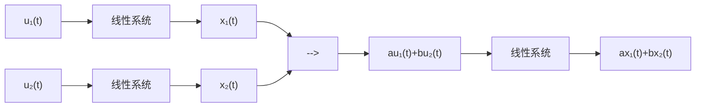
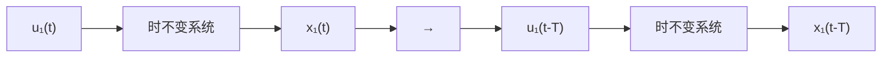

# 1.1 动态系统

控制理论的研究对象是动态系统(Dynamic System)。动态系统是指状态随时间变化的系统,其特点为系统的状态变量(State Variable)是时间的函数。如图 1.1.1 所示,在光滑的平面上对一辆质量为 $m$ 的小车施加一个随时间变化的外力 $u(t)$ ，这便构成了一个动态系统。其中，小车的位移 $x(t)$ 是此系统的状态变量，它是时间的函数。它随时间的变化率是其对时间 $t$ 的导数 $\frac{\mathrm{d}x(t)}{\mathrm{d}t}$ ，这也代表了小车的速度。而速度随时间的变化率为 $\frac{\mathrm{d}^2x(t)}{\mathrm{d}t^2}$ ，代表小车的加速度。根据牛顿第二定律，得到

text_image

x(t)
m
u(t)

图 1.1.1 动态系统举例

$$u (t) = m \frac {\mathrm{d} ^ {2} x (t)}{\mathrm{d} t ^ {2}} \tag {1.1.1}$$

在这个动态系统中, 将外力 $u(t)$ 定义为系统的输入 (Input), 将小车位移 $x(t)$ 定义为系统的输出 (Output)。式(1.1.1)说明给定的系统输入 (即作用在小车上的外力 $u(t)$ ) 将通过影响小车的加速度和小车的速度, 最终影响系统的输出 (小车的位移 $x(t)$ )。

在本书中, 若无特别说明, 研究的动态系统特指线性时不变系统 (Linear Time Invariant System)。其中, 线性指系统的输入与输出是线性映射的, 符合叠加原理 (Superposition Principle)。如图 1.1.2 所示, 如果一个线性系统在输入 $u_{1}(t)$ 的作用下, 输出是 $x_{1}(t)$ ; 在输入 $u_{2}(t)$ 的作用下, 输出是 $x_{2}(t)$ 。那么当输入为 $au_{1}(t) + bu_{2}(t)$ (其中 $a$ 和 $b$ 是常数)时, 系统的输出等于 $ax_{1}(t) + bx_{2}(t)$ 。

flowchart

图 1.1.2 线性系统性质

时不变性是指如果系统的输入信号延迟了时间 T，那么系统的输出也会延迟时间 T。如图 1.1.3 所示，系统在输入 $u_{1}(t)$ 作用下的输出是 $x_{1}(t)$ 。那么在延迟 T 之后的输入 $u_{1}(t-T)$ 作用下，系统的输出是 $x_{1}(t-T)$ 。一般情况下，时不变系统的数学表达式中都是常数系数（系数不是时间的函数）。

flowchart

图 1.1.3 时不变系统性质

线性时不变系统必须同时满足上面两个性质。请判断下面几例是否为线性时不变系统：

(1) $a \frac{\mathrm{d}^2 x(t)}{\mathrm{d}t^2} + b \frac{\mathrm{d}x(t)}{\mathrm{d}t} + c(t)x(t) = u(t)$

该系统为线性时变系统,因为参数 $c(t)$ 随时间变化。

(2) $a \frac{\mathrm{d}^2 x(t)}{\mathrm{d}t^2} + b \frac{\mathrm{d}x(t)}{\mathrm{d}t} + \sin x(t) = u(t)$

该系统为非线性时不变系统,其中非线性项为 $\sin x(t)$ , 而 $\sin x_{1}(t)+\sin x_{2}(t)\neq\sin(x_{1}(t)+x_{2}(t))$ 。

(3) $a \frac{\mathrm{d}^2 x(t)}{\mathrm{d}t^2} + b \frac{\mathrm{d}x(t)}{\mathrm{d}t} + cx(t) = u(t)$

该系统为线性时不变系统。

需要说明的是,从严格意义上讲,时不变系统是不存在的,因为“人不能两次踏进同一条河流”,但在大部分工程情况下,在系统分析的时间区间内,参数是恒定的或者是缓慢变化的。对于非线性的系统,一般可以做线性化处理(参考附录A)。不可以近似为线性时不变的系统不在本书的讨论范围之内。
