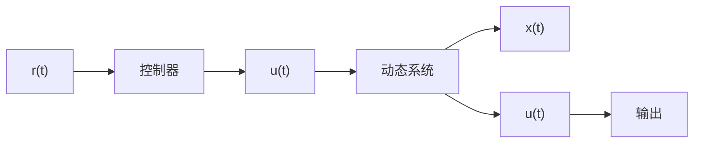
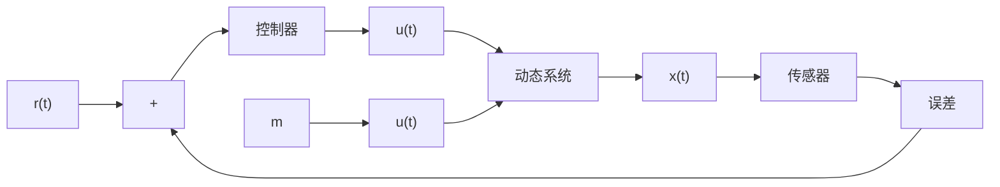

# 1.2 控制系统

通过研究动态系统的数学模型和系统表现,可以得到在给定输入 $u(t)$ 作用下的系统响应(Response, 即系统在输入 $u(t)$ 作用下的输出 $x(t)$ )。当掌握了动态系统输入与输出的关系之后, 就可以设计控制器来调节动态系统的输入, 使得系统的输出按照预期的目标响应。

一般而言,控制系统(Control System)由控制器(Controller)和动态系统组成。在图1.2.1所描述的控制系统中,其被控对象是图1.1.1中的动态系统。控制器会根据参考值(Reference) $r(t)$ 来决定控制量,即动态系统的输入 $u(t)$ 。这种简单的控制方式称为开环(Open Loop)控制。当系统的全部信息可知且准确时,开环控制可以完美地达成控制目标。在本例中,如果式(1.1.1)准确无误,那么就可以根据参考目标 $r(t)$ 设计作用在小车上的控制量 $u(t)$ ,使得小车的实际位移 $x(t)$ 与 $r(t)$ 保持一致。但如果系统的输入输出模型不够准确,或者系统存在扰动,例如在上述例子中,如果有物体掉落在小车内使其质量发生改变,那么基于式(1.1.1)的开环控制器将无法提供准确的控制量 $u(t)$ ,也就无法保障系统输出与目标值 $r(t)$ 一致。在实际应用场景中,扰动无处不在,而且完美的数学模型几乎是不存在的,因此开环控制大多只能应用在简单的、对精度要求不高的场景中,例如传统的电风扇,打开开关之后就会一直转,不用去关心被吹物体的温度。

flowchart

图 1.2.1 开环控制系统

如果希望精确地控制系统,则需要使用闭环(Closed Loop)控制系统,如图1.2.2所示,它与开环控制的最大区别是,在闭环控制中会测量系统的输出,并将其反馈(Feedback)到输入端与参考值进行比较。参考值与实际系统输出的差称为误差(Error),控制器将根据误差调整控制量。闭环控制系统可以实现高精度的控制,同时补偿由于外界扰动及系统建模不准确而引起的偏差。例如,空调系统会根据室内的实际测量温度调节出风口的风速和温度,智能手机会根据外界光强自动调节屏幕的亮度,这些都是闭环控制的例子。本书的重点就是分析闭环控制系统并设计控制器。

flowchart

图 1.2.2 闭环控制系统

本书视频内容介绍请扫描二维码。

