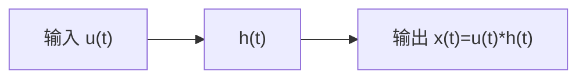

$$
\begin{array}{l} x (t) = \lim _ {\Delta T \rightarrow 0} \sum_ {i = 0} ^ {n} u (i \Delta T) \Delta T h _ {\Delta} (t - i \Delta T) \\ = \int_ {0} ^ {t} u (\tau) h (t - \tau) \mathrm{d} \tau = u (t) * h (t) \tag {2.1.10} \\ \end{array}
$$

flowchart

图 2.1.6 动态系统输入与输出的卷积关系

其中， $h(t)$ 是系统对于冲激函数 $\delta(t)$ 的冲激响应（Impulse Response）。式(2.1.10)可以用框图表示，如图2.1.6所示。

通过式(2.1.10)和图2.1.6可以得出，冲激响应 $h(t)$ 包含了线性时不变系统的全部特性。

关于这个性质,读者可以尝试做一个有趣的实验。首先寻找一个空旷的地方,例如操场或者礼堂。然后扎破一个气球或者用力拍手,要保证时间很短但能量很大,这样就制造了一个冲激输入。然后用麦克风录制下这个声音,得到这个地方的冲激响应。之后,可以把其他的声音和这个冲激响应做卷积运算,就可以模拟这个地方的混响了。有很多的公司都会在音乐厅最好的位置采集素材,合成到唱片当中,由此创造出一种身临其境的感觉。

卷积的应用视频请扫描此二维码观看。
