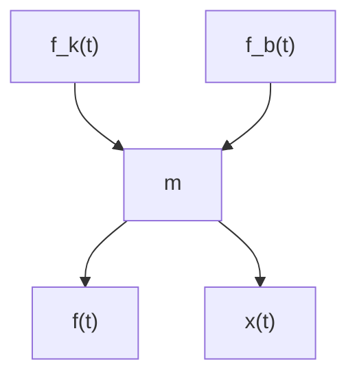

# 例 2.1.2 电路系统。

图 2.1.8 所示为典型的电路网络系统,包含了电源 $e(t)$ 、电感 L、电容 C 和电阻 R。对于电路系统的数学建模,可以使用基尔霍夫电压定律(Kirchhoff's Voltage Law):沿着闭合回路的所有电动势的代数和等于所有电压降的代数和。

具体步骤为沿着电流的参考方向(方向可以任意选定, 此例中选择顺时针方向), 给每一个元器件上的电压标明正负号, 在元器件内, 电流从正极向负极流动, 如图 2.1.8 所示。根据各个元器件特性, 它们的电压分别为

$$
\begin{array}{r l} & {\text {电感电压:} e _ {\mathrm{L}} (t) = L \frac {\mathrm{d} i (t)}{\mathrm{d} t}} \\ & {\text {电容电压:} e _ {\mathrm{C}} (t) = \frac {1}{C} \int_ {0} ^ {t} i (t) \mathrm{d} t} \\ & {\text {电阻电压:} e _ {\mathrm{R}} (t) = i (t) R} \end{array} \tag {2.1.15}
$$

以上三项电压与参考电流的方向一致,所以取正号。而电源电压 $e(t)$ 与参考电流方向相反,所以取负号。根据基尔霍夫电压定律,可得

$$e _ {\mathrm{L}} (t) + e _ {\mathrm{C}} (t) + e _ {\mathrm{R}} (t) - e (t) = 0 \tag {2.1.16}$$

将式(2.1.15)代入式(2.1.16)，可得

$$L \frac {\mathrm{d} i (t)}{\mathrm{d} t} + \frac {1}{C} \int_ {0} ^ {t} i (t) \mathrm{d} t + i (t) R - e (t) = 0 \tag {2.1.17}$$

等式两边同时对时间 $t$ 求导，可以消除积分项 $\frac{1}{C}\int_0^t i(t)\mathrm{d}t$ ，调整 $e(t)$ 的位置，可得

$$\frac {\mathrm{d} e (t)}{\mathrm{d} t} = L \frac {\mathrm{d} ^ {2} i (t)}{\mathrm{d} t ^ {2}} + R \frac {\mathrm{d} i (t)}{\mathrm{d} t} + \frac {1}{C} i (t) \tag {2.1.18}$$

式(2.1.18)描述了电流 $i(t)$ 与电压 $e(t)$ 之间的关系, 它是一个关于电流的二阶微分方程。

例 2.1.3 弹簧质量阻尼系统。

弹簧质量阻尼系统在工程中有很广泛的应用,绝大部分与振动相关的系统都可以简化成图 2.1.9(a) 的模式,如果把它竖起来就是四分之一个汽车悬挂系统。

text_image

k
m
f(t)
b

(a) 弹簧质量阻尼系统示意图

flowchart

(b) 质量块受力分析  
图 2.1.9 弹簧质量阻尼系统

对这一系统进行数学建模,首先要对质量块进行受力分析,如图 2.1.9(b) 所示,令 $x(t)$ 表示质量块的位移并设向右为正方向, $x(t)=0$ 时代表了弹簧的自由状态,不压缩也不拉伸。它受到外力 $f(t)$ 、弹簧力 $f_{k}(t)$ 以及阻尼力 $f_{b}(t)$ 的共同作用。根据胡克定律,弹簧力为

$$f _ {k} (t) = - k x (t) \tag {2.1.19}$$

其中，k 表示弹簧的弹性系数。弹簧力和位移成正比，因为其方向与位移 $x(t)$ 相反，所以取负号。

阻尼力为

$$f _ {b} (t) = - b \frac {\mathrm{d} x (t)}{\mathrm{d} t} \tag {2.1.20}$$

其中， $b$ 表示阻尼系数。式(2.1.20)说明阻尼力与物体的移动速度（位移对时间的一次导数）成正比且方向与移动方向相反。

读者可以通过一个小实验感受阻尼力与速度的关系：接一盆水，然后将手放入水中滑动，你会发现滑动速度越快，感受到的阻力就会越大。反之，缓慢地将手从水中拂过，则不会感受到很大的阻力。

根据牛顿第二定律, $m\frac{\mathrm{d}^{2}x(t)}{\mathrm{d}t^{2}}=f(t)-f_{k}(t)-f_{b}(t)$ ，将式(2.1.19)和式(2.1.20)代入并整理即可得到位移的二阶微分方程，即

$$m \frac {\mathrm{d} ^ {2} x (t)}{\mathrm{d} t ^ {2}} + b \frac {\mathrm{d} x (t)}{\mathrm{d} t} + k x (t) = f (t) \tag {2.1.21}$$

式(2.1.21)是振动系统的基本形式。这个例子会多次出现在本书后面章节的分析当中。
