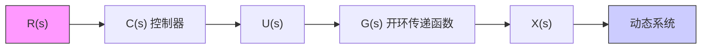
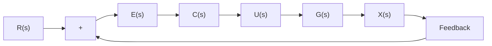

# 2.3.2 控制系统传递函数

在掌握了动态系统的传递函数 $G(s)$ 之后,便可以着手设计控制器来调节该动态系统的输出响应。如图 2.3.3 所示的开环控制系统(Open Loop Control System): 其中 $R(s)$ 是参考值(Reference)或目标值, $C(s)$ 是控制器, 原动态系统的传递函数 $G(s)$ 被称为控制系统的开环传递函数(Open Loop Transfer Function)。控制量是 $U(s)$ , 也就是原动态系统的输入。控制系统的输出等于原动态系统的输出 $X(s)$ 。

flowchart

图 2.3.3 开环控制系统框图

控制系统本质上也是一个动态系统,从参考值 $R(s)$ (它同时也是该控制系统的输入,又称参考输入)到系统输出 $X(s)$ 是串联的结构,即

$$X (s) = U (s) G (s) = R (s) C (s) G (s) \tag {2.3.11}$$

其中，控制量 $U(s) = R(s)C(s)$ ，说明系统的输出 $X(s)$ 对控制量 $U(s)$ 没有影响，这也是开环系统的特点。

若将输出 $X(s)$ 反馈到输入端, 则可以形成一个闭环控制系统, 如图2.3.4所示。其中, 参考值与输出之间的差称为误差 (Error), $E(s) = R(s) - X(s)$ , 其对应的时间函数是 $e(t) = r(t) - x(t)$ , 控制器 $C(s)$ 将根据误差决定控制量 $U(s)$ 。

flowchart

图 2.3.4 闭环控制系统框图

根据传递函数的代数性质,可得

$$X (s) = U (s) G (s) = E (s) C (s) G (s) \tag {2.3.12}$$

将 $E(s)=R(s)-X(s)$ 代入式(2.3.12)中，可得

$$X (s) = (R (s) - X (s)) C (s) G (s)\Rightarrow (1 + C (s) G (s)) X (s) = C (s) G (s) R (s)\Rightarrow X (s) = \frac {C (s) G (s) R (s)}{1 + C (s) G (s)} \tag {2.3.13}$$

定义控制系统的闭环传递函数(Closed Loop Transfer Function)为

$$G _ {\mathrm{cl}} (s) = \frac {X (s)}{R (s)} = \frac {C (s) G (s)}{1 + C (s) G (s)} \tag {2.3.14}$$

由此可以得到一个简化后的闭环控制系统框图,如图2.3.5所示。

图 2.3.5 所描述的控制系统输入是参考输入 $R(s)$ ，输出是 $X(s)$ 。

flowchart

图 2.3.5 简化后的闭环控制系统框图

传递函数系统建模内容请扫描此二维码观看。

