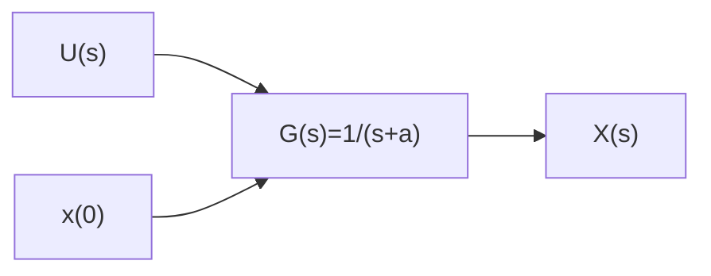

# 2.4 非零初始状态下的传递函数

在传递函数的定义中有一个先决条件,即零初始条件。但在实际情况中,往往需要处理非零初始状态的系统。本节将对此内容进行简单的探讨,考虑一个一阶微分方程:

$$\frac {\mathrm{d} x (t)}{\mathrm{d} t} + a x (t) = u (t) \tag {2.4.1}$$

对式(2.4.1)两边进行拉普拉斯变换,根据例2.2.4,可得

$$\mathcal {L} \left[ \frac {\mathrm{d} x (t)}{\mathrm{d} t} + a x (t) \right] = \mathcal {L} [ u (t) ]s X (s) - x (0) + a X (s) = U (s) \tag {2.4.2}$$

在零初始条件下 $(x(0)=0)$ ，式(2.4.2)可写成 $sX(s)+aX(s)=U(s)$ ，系统的传递函数是

$$G (s) = \frac {X (s)}{U (s)} = \frac {1}{s + a} \tag {2.4.3}$$

而当 $x(0) \neq 0$ 时，式(2.4.2)可以写成

$$s X (s) + a X (s) = U (s) + x (0) \tag {2.4.4}$$

此时定义新的系统输入： $U_{1}(s)=U(s)+x(0)$ ，代入式(2.4.4)中，得到

$$G (s) = \frac {X (s)}{U _ {1} (s)} = \frac {1}{s + a} \tag {2.4.5}$$

式(2.4.3)和式(2.4.5)的系统框图如图2.4.1所示。可见这两个系统的传递函数是相同的,其中非零初始条件系统多出一个输入,而这个输入的拉普拉斯变换等于其初始条件 $x(0)$ 。对它进行拉普拉斯逆变换可以得到其原函数,即

$$\mathcal {L} ^ {- 1} [ x (0) ] = x (0) \delta (t) \tag {2.4.6}$$

其中, $\delta(t)$ 是单位冲激函数, 在 2.1.1 节介绍过, 可以把它理解为在很短的时间内释放出的一个单位的能量。将它乘以一个系数 $x(0)$ , 则相当于在一瞬间对系统施加了 $x(0)$ 个单位的能量 (系统的输出也将叠加 $x(0)h(t)$ )。因为这个能量是瞬间的, 并不持续, 所以它不会影响到系统的稳定性分析与特征分析。高阶系统的非零初始条件的分析则比较复杂, 但是其理念与一阶系统相同, 系统的初始状态可以理解为瞬时间赋予系统的“能量”。

  
(a) 零初始条件系统框图

flowchart

(b) 非零初始条件系统框图  
图 2.4.1 零初始条件和非零初始条件系统框图
