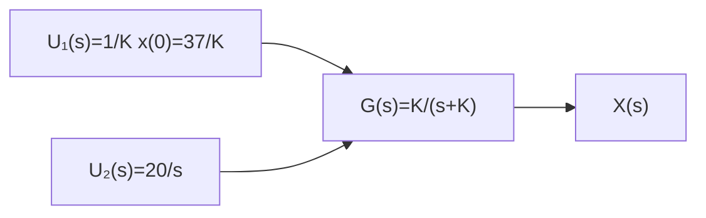

# 4.3 案发时间揭秘

在 4.2 节中,我们充分讨论了一阶系统的冲激响应和阶跃响应。现在回到本章开始的案例,揭秘案发的时间。式(4.1.5)所对应的系统框图如图4.3.1所示。

flowchart

图 4.3.1 系统框图

系统的输入分为两部分：其中 $U_{1}(s) = \frac{37}{K}$ 是冲激输入， $U_{2}(s) = \frac{20}{s}$ 是阶跃输入。因此，系统的

输出是对这两部分输入响应的和(冲激响应加阶跃响应)。

根据式(4.2.12b)，输出 $x_{1}(t) = x_{0}\mathrm{e}^{-Kt} = 37\mathrm{e}^{-Kt}$ 。根据式(4.2.15)， $x_{2}(t) = 20(1 - \mathrm{e}^{-Kt})$ 它是20倍的单位阶跃响应。 $x_{1}(t)$ 与 $x_{2}(t)$ 如图4.3.2(a)所示。叠加后的响应为

$$x (t) = x _ {1} (t) + x _ {2} (t) = 3 7 \mathrm{e} ^ {- K t} + 2 0 (1 - \mathrm{e} ^ {- K t}) = 2 0 + 1 7 \mathrm{e} ^ {- K t} \tag {4.3.1}$$

$x(t)$ 随时间的变化如图 4.3.2(b) 所示。

此时将两个已知条件代入式(4.3.1)(下午2:30时体温为 $26^{\circ}C$ ，下午3:30时体温为 $25^{\circ}C$ )，并设下午2:30时已经距离死亡时间过去了 $t_{1}$ 小时，可得

$$
\left\{ \begin{array}{l} 2 6 = 2 0 + 1 7 \mathrm{e} ^ {- K t _ {1}} \\ 2 5 = 2 0 + 1 7 \mathrm{e} ^ {- K (t _ {1} + 1)} \end{array} \right. \tag {4.3.2}
$$

求解式(4.3.2)所示方程组,得到

line

| t | x₁(t) | x₂(t) |
| --- | --- | --- |
| 0 | 0 | 37 |
| >0 | <10 | 20 |

(a) $x_{1}(t)$ 和 $x_{2}(t)$ 随时间的变化

line

| t | x(t)/°C |
| --- | --- |
| 0 | 37 |
| t₁ | 26 |
| t₁+1 | 25 |
| t₂ | 20 |

(b) $x(t)$ 随时间的变化  
图 4.3.2 式(4.3.1)的输出响应

$$
\left\{ \begin{array}{l} K = 0. 1 8 2 \\ t _ {1} = 5. 7 2 \end{array} \right. \tag {4.3.3}
$$

式(4.3.3)说明在下午2:30的时候,距离死亡时间已经过去了5.72小时(5小时43分钟),所以案发时间大概是上午8:47。
