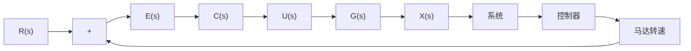

# 5.4.1 二阶系统的重要性能指标

考虑一个实际的控制器设计案例,设想你作为一个项目经理负责开发一个无人机项目。目标是设计一套算法自动控制无人机的高度,工程设计团队开发了一套反馈控制系统,如图5.4.1所示。控制框图如图5.4.1(b)所示,其中 $R(s)$ 是参考值, $E(s)$ 是误差。 $C(s)$ 是控制器,其包含的控制算法会根据无人机的实际高度 $X(s)$ 与参考(目标)高度 $R(s)$ 的差值(误差 $E(s)$ )来决定控制量,即马达的转速 $U(s)$ 。根据框图化简原理,图5.4.1(b)可以化简为图5.4.1(c)。简化后的框图(控制系统)输入是参考值 $R(s)$ ,输出是高度的拉普拉斯变换 $X(s)$ 。闭环控制系统的传递函数是 $\frac{C(s)G(s)}{1+C(s)G(s)}$ 。

text_image

参考
高度
x(x)
误差
实际
高度

(a) 无人机高度控制

flowchart

(b) 闭环控制系统框图  
  
(c) 闭环控制系统简化框图  
图 5.4.1 控制器设计二阶系统例子

在实际工程应用中,大部分关于运动控制的系统,简化后的闭环传递函数都会呈现出二阶系统的表现,即可以近似认为图5.4.1(c)中的 $\frac{C(s)G(s)}{1+C(s)G(s)}=\frac{\omega_{n}^{2}}{s^{2}+2\zeta\omega_{n}s+\omega_{n}^{2}}$ 。

从直观理解,控制系统设计相当于将无人机挂在了一个“看不见”的弹簧阻尼系统上面,如图5.4.2所示,而控制器的设计过程就是设计这个弹簧阻尼系统的固有频率和阻尼比。

根据设定，“你”的角色是产品经理，因此你的关注点不在控制器的设计上，而是如何评估控制系统（有关“看不见”的弹簧阻尼系统设计请参考7.3.2节）。现在假设算法工程师提供了三种方案，经过测试后无人机都可以从初始高度达到目标高度，但它们的运行轨迹不同，如图5.4.2所示的三条轨迹。作为项目经理，请问你会如何评价这三种算法，又会选择哪一种呢？读者可以记录下你现在的选择，与本章最后的分析与结果进行比较。

text_image

高度
轨迹1
轨迹2
轨迹3
参考
高度
初始
高度
时间

图 5.4.2 无人机高度控制

line

| t | x(t) |
| --- | --- |
| Tr | 0 |
| Mp | 1 |
| Ts | 1 |

图 5.4.3 二阶系统的单位阶跃响应性能指标

各位读者在今后的科研或者工作中,会经常遇到类似的系统分析的问题。为了得到令人信服的评估结果,需要一些量化的指标。下面将列出三个指标参数来描述二阶系统的性能,其他指标都可以通过这三个指标推导出来。图 5.4.3 是一个典型的欠阻尼二阶系统的单位阶跃响应,以它为例,定义如下性能指标。

(1) 上升时间(Rise Time) $T_{r}$ ：是指系统第一次到达稳定点的时间，有的系统达不到稳定状态,就取稳定值的90%。这一参数体现了系统的反应速度。
