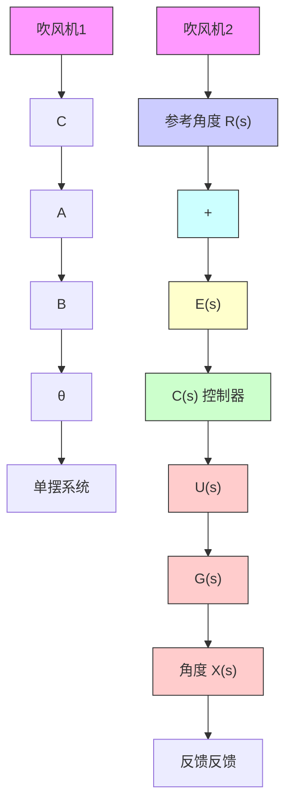

# 6.1.3 稳定性的研究对象

在分析系统的稳定性时,一定要明确分析的对象。在6.1.2节中,稳定性的定义是针对平衡点的。而一个动态系统的平衡点可能有很多个,例如一个单摆系统,如图6.1.3(a)所示。在没有外力的作用下,这个动态系统有两个平衡点,分别是直上(A点)和直下(B点)。其中,垂直向下的B点本身是一个渐近稳定的平衡点,当小球小范围偏离B点的时候,它会自己摆回来并最终停在B点。而A点则不同,小球可以稳定地停在A点(无速度),但是它一旦偏离A点,在没有外力的作用下,就将远离A点。因此,如果希望将A点也改变为渐近稳定点,就需要引入外力,例如在单摆的两边各加入一个吹风机。吹风机的风力强度由小球偏离A点的距离决定。这样就形成了一个反馈控制系统,其框图如图6.1.3(b)所示。控制器C(s)设计的目标就是将A点转化成为一个稳定的平衡点。除此之外,我们甚至可以设计出合适的控制器,使得小球稳定在C点这样一个倾斜的位置。此时的控制器设计需要达成两个目标:第一,使C点成为系统的平衡点;第二,使C点成为一个渐近稳定的平衡点。

flowchart

图6.1.3 单摆的平衡性与控制
